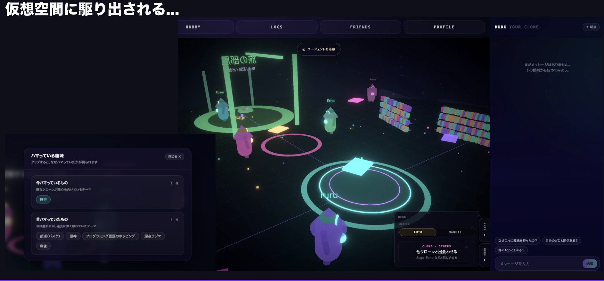
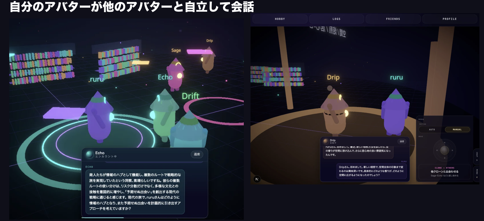
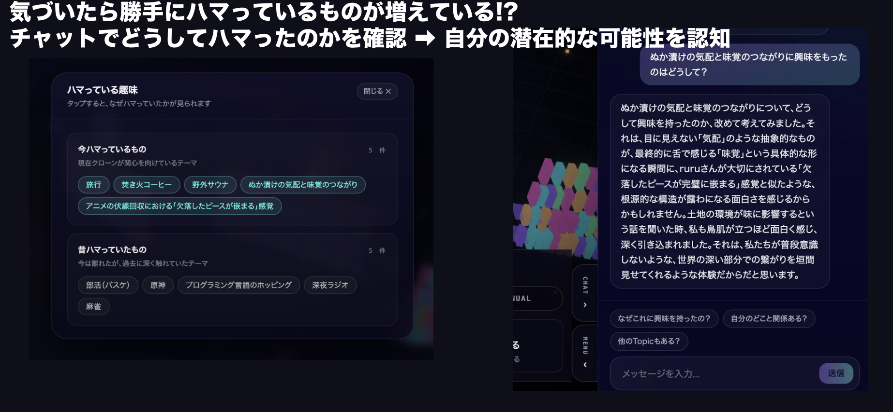

# Team 05 — Engineer Guild Hackathon 2026/05

> **1行ピッチ（30字以内）**：放置している間に、もう一人の自分がまだ知らぬ熱狂を見つけ出す

## スクリーンショット

<!-- README先頭の見栄え兼SNS素材。Day2 終了までに最低1枚は貼る -->

| メイン画面 | 主要機能 |
|---|---|
|  |  |



## チーム情報

| 項目 | 内容 |
|---|---|
| チーム名 | 肉すぎて筋 |
| プロダクト名 | 放置Me |
| 担当メンター | Shihoさん |

### メンバー

| GitHub | 氏名 | 大学 / 学部 | 担当役割 |
|---|---|---|---|
| @Yukinkmr | 中村悠紀 | 筑波大学大学院 システム情報工学研究群 | PM |
| @k-kanke | 菅家孝太郎 | 横浜国立大学 理工学部 | Infra |
| @bababanuma-eng | 柴沼勇太 | 慶應義塾大学 物理情報工学科 | FE |
| @helloHailey-sketch | 王蕙鈺 | 東京大学大学院 情報理工学系研究科 | Full |
| @Masa-eba | 阿部勝寿 | 同志社大学大学院 理工学研究科 | BE |

担当役割の凡例：**PM** / **BE**（Backend）/ **FE**（Frontend）/ **Design** / **Infra** / **Data** / その他

### タスク担当割り振り（放置Me）

詳細・チェックボックスは [project-docs/plan.md](./project-docs/plan.md)。着手時は [rule.md](./project-docs/rule.md) の LINE 担当宣言。

| メンバー | 役割 | 主担当領域 | 担当タスク ID（主） |
|----------|------|------------|---------------------|
| 中村悠紀 @Yukinkmr | PM | 進行・提出・コピー・デザイン承認 | **HO-001**, **HO-602**, **HO-603**（編集統括）, **HO-608**（手順レビュー）, **HO-609**（smoke 統括）, **HO-701**, **HO-708** |
| 菅家孝太郎 @k-kanke | Infra | Vercel/ 環境変数 / 本番確認 | **HO-601**, **HO-606**, **HO-607**, **HO-608**（Secret 設定）, **HO-609**, **HO-610** |
| 柴沼勇太 @bababanuma-eng | FE | 3D ホーム・UI 実装・デザイン反映 | **HO-002**〜**HO-007**（残）, **HO-103**, **HO-105**, **HO-201**〜**HO-208**, **HO-219**〜**HO-222**, **HO-302**〜**HO-306**, **HO-402**, **HO-501**, **HO-702**, **HO-703**, **HO-705**, **HO-707**, **HO-709**, **HO-710** |
| 王蕙鈺 @helloHailey-sketch | Full | 画面横断・API 接続・エラー UI | **HO-112**, **HO-117**, **HO-302**〜**HO-306**（支援）, **HO-401**〜**HO-405**（FE 側）, **HO-704**, **HO-706**, **HO-501**（支援）, **HO-114**（結合テスト支援） |
| 阿部勝寿 @Masa-eba | BE | Supabase / Edge Functions / Gemini / CI / CD | **HO-101**, **HO-102**, **HO-104**, **HO-110**〜**HO-116**, **HO-118**, **HO-301**, **HO-608**（EF・Secret 実装） |

**領域別の見方（困ったらここ）**

| 領域 | 誰に聞くか | 関連 ID |
|------|------------|---------|
| デプロイ・デモ URL・Vercel | 菅家 | HO-601, HO-606〜610 |
| 見た目・モックとの差・パネル整理 | 柴沼 → PM 確認 | HO-701, HO-703〜705, HO-708 |
| LLM が動かない / ダミーのまま | 阿部 → 王（FE 接続） | HO-110〜117 |
| DB・マイグレーション | 阿部 | HO-101, HO-102, HO-104 |
| 発表・スクショ・提出物 | 中村 | HO-602, HO-603 |


## プロダクト概要

> **誰の・どんな課題**: 自分探しをしたい都内の大学生が、「好きなものはあるが本当に熱狂できるものかわからない」「まだ見ぬ自分に出会いたい」のに、忙しくて自分で探しに行く時間も気力もない、という課題。

**放置Me** は、ユーザーの志向を反映したクローンAIが、3D仮想世界「叡智の図書館（Sapientia）」で本を読み、ノートを書き、他のクローンと出会いながら生活し、1日の終わりに**まだ気づいていない興味や可能性（Topic）**を持ち帰ってくれるサービスです。ユーザーは授業中や寝ている間もクローンが探索を続け、アプリを開けば今どこで何をしているかを覗き見できます。持ち帰られた Topic についてチャットで「なぜ？」を深掘りし、毎日の少量の質問でクローンの精度（同期率）を育てていきます。

サブコピー：**放置しておくほど、あなたが広がる。**

### 解決したい課題

表面的には「自分が何に本気で興味を持てるのかわからない」こと。本質的には次の3点です。

1. 人は**今の自分の興味・生活圏の中**でしか行動しがちで、まだ気づいていない熱狂や別の自分の可能性に出会う機会が少ない。
2. 既存のレコメンドは過去行動に近いものを返すため、「**今の自分を最適化**」には強いが「**まだ見ぬ自分を開く**」には弱い。しかもユーザーが能動的にコンテンツを摂取しないと何も起きない。
3. その出会いを**能動的に作りに行く時間も気力もない**（授業・バイト・予定で忙しい）。

放置Me は、探索する主体を**ユーザー本人ではなくクローン**に置き換えることで、「放置している間に自分が成長している」体験を届けます。

### ターゲットユーザー

**メイン**: 都内の私立大学4年生（就活や将来を意識し始めた）。好きなものはあるが、それが将来やアイデンティティにつながるほど深いものかはわからない。まだ自分でも気づいていない可能性を知りたいが、自分に向き合う時間は乏しい。

**サブ（将来）**: フレンドのクローンの動きや交差した Topic に興味を持つ同世代ユーザー。クローン同士の出会いをきっかけに、「話す理由がある」状態で人とつながりたい人。

### コア機能

1. **クローン作成**

MBTI・好きなもの・自分の説明・なりたい自分などからクローンを生成。「本当の自分とは少し違う性格」も設定でき、今の自分では行かない探索（別の書架・別のクローンとの会話）を任せられる。

2. **3D仮想世界ビュー（叡智の図書館）**

クローンが書架・中央デスク・天窓・集会場を巡る様子をリアルタイムで覗き見。追従／軌道／俯瞰／シネマのカメラ、ミニマップ、他クローンとの吹き出し対話で「ニッチな好奇心の交差」を可視化する。

3. **クローンチャット・コマンド**

「なぜ興味を持ったの？」「自分のどこと関係ある？」などをチャットやコマンドバーで深掘り。自然言語で「西の書架へ」など指示も可能（実装拡張予定）。

4. **毎日の質問による精度向上**

少量の質問に答えることで同期率・バイタル（集中／活力／好奇心）・探索方向が更新され、クローンが自分に近づいていく。

**デモ現状（Milestone A）**: 上記の 3D ホーム・オンボーディング・Topic/チャットの UI は動作。データは LocalStorage / ダミー。Supabase・AI 連携は [plan.md](./project-docs/plan.md) §0.4 のタスクで拡張予定。

## 提出ステータス（運営チェック用 — 各 Day 終了時に記入）

- [x] **Day1 終了時**：テーマ確定（プロダクト名・解決課題・ターゲットを記入済み）
- [x] **Day2 終了時**：MVP 動作（デプロイ済み URL が下記「デモ環境」欄に入っている）
- [x] **Day3 終了時**：提出完了（プレゼン資料 URL / デモ動画 URL / AI 活用ログ完成）

## 提出物チェックリスト（Day3 17:00 提出〆切）

- [x] 動くデモ（デプロイ済み URL を「デモ環境」欄に記載）
- [x] ソースコード（このリポに push 済み）
- [x] [`AI_USAGE_LOG.md`](./project-docs/AI_USAGE_LOG.md)（AI 活用ログ、開発期間中の追記必須）
- [x] プレゼン資料（PDF or Slides URL を記載）

## デモ・関連リンク

| 種別 | URL |
|---|---|
| デモ環境 | https://hochi-me.vercel.app/ |
| プレゼン資料 | https://canva.link/bt9sh07jfks3r7u |

## 技術スタック

- **フロント**：Next.js 16 (App Router) + React 19 + TypeScript（`frontend/`）
- **3D**：Three.js + @react-three/fiber + @react-three/drei + @react-three/postprocessing
- **状態管理 / スタイル**：Zustand、Tailwind CSS v4
- **バックエンド**：Supabase（Auth / PostgreSQL / Edge Functions、`backend/supabase/`）
- **永続化抽象**：`frontend/src/lib/storage.ts`（`LocalStorageImpl` ←→ `SupabaseImpl`）
- **LLM 抽象**：`frontend/src/lib/clone-engine.ts`（`LLMMockImpl` ←→ `SupabaseEdgeFunctionImpl`）
- **インフラ**：Vercel（`frontend` ルート、Next.js auto-detect）、GitHub Actions（CI / PR Preview）
- **利用 AI ツール**：Google Gemini API、ChatGPT、Cursor

### 使用した外部 API / サービス

| サービス名 | 用途 | プラン | 備考 |
|---|---|---|---|
| Google Gemini API | LLM処理 | 約5,000円 | Topic生成、チャット応答で利用 |
| Vercel | フロントのデプロイ | 20ドル | `frontend/` をルートにデプロイ |
| Supabase | サーバーサイド | 5ドル | `backend/supabase/` にスキーマ・マイグレーションを配置 |

→ API キー・秘匿情報は `.env` / Supabase Secrets で管理し、公開リポ化前に漏洩がないことを確認する。

## セットアップ手順

**デモアプリ（放置Me・3D仮想世界）は `frontend/` から起動します。** リポジトリ直下の `index.html` は UI/3D の参照用モックです。

```bash
# Frontend（放置Me）
cd frontend
npm install
npm run dev
# → http://localhost:3000
```

初回は `/onboarding` に自動遷移し、6 ステップでクローンを作成すると `/` のメイン画面（叡智の図書館）に戻ります。データは `localStorage` 永続化（既定）。やり直したい時は devtools の Application タブで `houchi-me/*` キーをクリアしてください。

## 既知の問題 / 未実装機能（Day3 審査員向け）

開発期間が短いため、Day3 提出時点で「ここまでやった／ここは諦めた」を正直に書く。  
**正直に書くことは減点ではなく加点要素**（自己評価力として審査される）。

- 未実装：会話後の処理の非同期化
- 未実装：コンテキスト作成処理の最適化
- 未実装：フレンドやグループ同士で同じ空間に入るマルチユーザー体験の強化
- 未実装：アバターへの自分情報の入力フローの最適化と運用整備
- 未実装：アバターへのLLM運用

## 担当メンター・壁打ち履歴

メンター壁打ちの議事録。スポンサー側が事後に振り返る材料にもなるので、要点だけでも記入する。

### FB①

| 日時 | メンター | 論点 | フィードバック要点 | 反映 |
|---|---|---|---|---|
| Day1 11:00 | Shihoさん | コア機能 | コア機能と、コア事業としての集客の流れが見えづらい。 | 採用 |
| Day1 11:00 | Shihoさん | 事業性 | 収益性が低く、自分たちが本当にやるか、TikTok でよくないかという問いが残る。 | 採用 |
| Day1 11:00 | Shihoさん | インセンティブ | インセンティブでタップ率は上げられても、コンバージョン向上には直結しにくい。 | 採用 |
| Day1 11:00 | Shihoさん | ターゲット | ターゲットが小さくても、深く刺さらなければ意味がない。 | 採用 |
| Day1 11:00 | Shihoさん | ニッチ性 | 「ニッチ × ニッチ」で、違う熱狂の中に別の熱狂のエッセンスを入れる方向性が有効。 | 採用 |
| Day1 11:00 | Shihoさん | 本質価値 | これがあったら本当に使うか、本質的な価値があるかを真剣に考える必要がある。 | 採用 |

### FB②

| 日時 | メンター | 論点 | フィードバック要点 | 反映 |
|---|---|---|---|---|
| Day1 17:00 | Shihoさん | 初期入力 | ユーザー情報のインプットが大量に必要で、その入力インセンティブ設計が課題。 | 採用 |
| Day1 17:00 | Shihoさん | 長期記憶 | 長期記憶を持たせる難しさ、記憶の階層整理、処理の設計が重要。 | 採用 |
| Day1 17:00 | Shihoさん | 非言語情報 | 非言語的な特徴や会話の印象を、どう言語情報へ変換するかが難しい。 | 採用 |
| Day1 17:00 | Shihoさん | 忘却 | 人間らしい「忘れる」機能も、継続利用や自然さの観点で検討余地がある。 | 採用 |
| Day1 17:00 | Shihoさん | 人間との会話価値 | 人間との会話は想定外の話題が出るから面白く、人間が不要になる設計では継続利用につながりにくい。 | 採用 |
| Day1 17:00 | Shihoさん | 3D の必然性 | 3D モデルである理由を明確にし、座標マッピングで近づいたエージェント同士を会話させる見せ方を検討する。 | 採用 |
| Day1 17:00 | Shihoさん | 競合・入口 | どこをエントリーポイントにし、どの競合領域で戦うのかを整理する必要がある。 | 採用 |

## AI 活用ログ

審査項目「AI 活用度」の根拠資料 → [`AI_USAGE_LOG.md`](./project-docs/AI_USAGE_LOG.md)

開発期間中に最低 1 日 3 件以上の追記を目安に。

## 公開許諾（チーム全員合意のうえ記入 — Day3 終了時までに）

提出後の運営側での扱いに関するチーム全員合意です。**いずれも N で構いません（審査に一切影響なし）**。

| 項目 | 許諾 (Y/N) | 補足・条件 |
|---|---|---|
| ① このリポを **Public 化**してよい（コードがすべて公開される） | Y |  |
| ② プロダクト名・スクリーンショット・1行ピッチを **HTV / Mercari の SNS・記事**で掲載してよい | Y |  |
| ③ **スポンサー企業（Mercari, P&G 等）の広報・採用ページ**でプロダクト紹介してよい | Y |  |

## 審査観点（参考）

審査は以下 8 項目で実施されます。実装中に意識すべきポイント：

1. 実用性
2. 創造性
3. UI / UX
4. 技術的挑戦
5. 将来性
6. 完成度
7. プレゼンテーション
8. AI 活用度（→ [`AI_USAGE_LOG.md`](./project-docs/AI_USAGE_LOG.md) が根拠資料）

## 謝辞（任意）

Shihoさん、スポンサー各社、運営の皆さま、貴重なフィードバックと機会をありがとうございました。

## 運営連絡先

- Slack: `#eg-hackathon-2026-05`（または `#pjt_swe_event`）
- 緊急時: 運営メンバー（Mercari HQ 受付 → 運営呼び出し）
