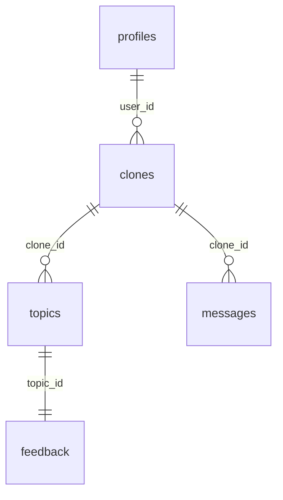

# Database Schema — 放置me

frontend/src/types/index.ts と 1:1 対応するスキーマ。
ローカル MVP は frontend の `LocalStorageImpl` で動くため、Supabase は本番接続時のみ必要。

## Tables

| Table | Description |
| ----- | ----------- |
| [profiles](profiles.md) | `auth.users` 1:1 のユーザープロフィール |
| [clones](clones.md) | ユーザー × クローン (現状 1 ユーザー 1 クローン想定) |
| [topics](topics.md) | 1日1Topic (`date_key` で日次ユニーク) |
| [messages](messages.md) | クローンチャットの履歴 |
| [feedback](feedback.md) | Topic への「気になる/違う/もっと知りたい」 |

## Relations

## RLS

すべてのテーブルで RLS を有効化。`auth.uid()` で本人 (= `profiles.id` または `clones.user_id`) のみ読み書き可。
`topics` / `messages` / `feedback` は紐づく `clones` の所有者だけがアクセスできる。

## 自動トリガ

`auth.users` への INSERT 時に `profiles` を自動作成 (`public.handle_new_user`)。
