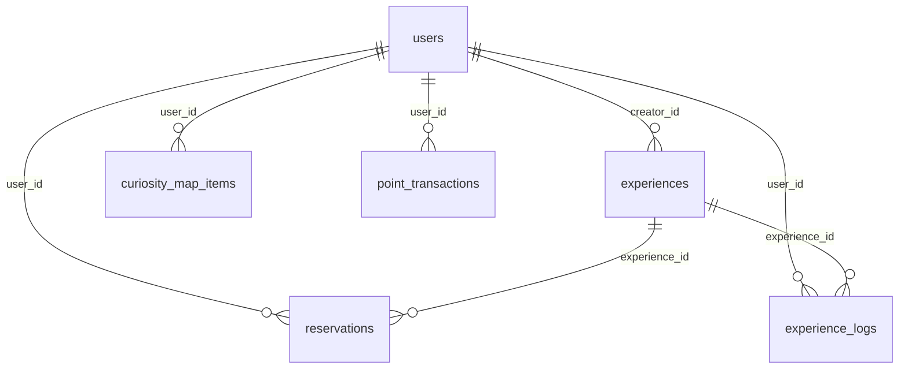

# Database Schema

## Tables

| Table | Description |
| ----- | ----------- |
| [users](users.md) | ユーザー情報（ポイント・称号） |
| [experiences](experiences.md) | 体験会 |
| [reservations](reservations.md) | ���約（status: reserved / joined / cancelled） |
| [experience_logs](experience_logs.md) | 参加後ログ |
| [curiosity_map_items](curiosity_map_items.md) | 好奇心マップ（ユーザー × カテゴリ） |
| [point_transactions](point_transactions.md) | ポイント履歴 |

## Relations

