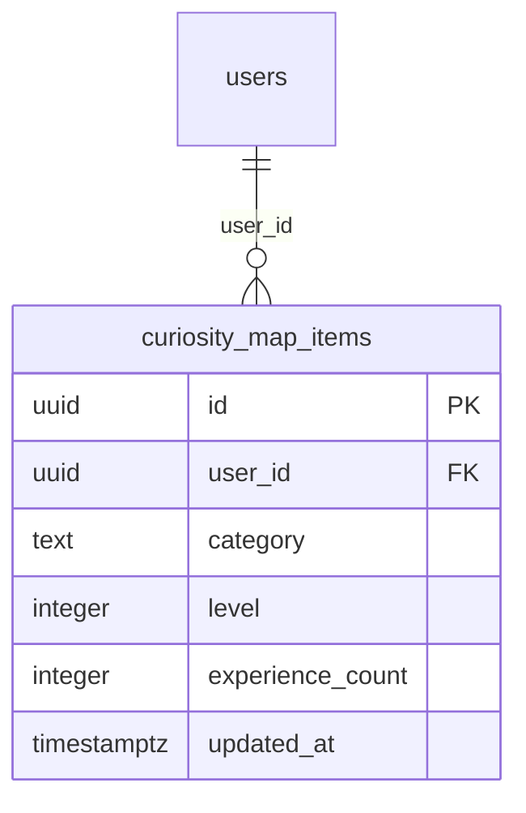

# curiosity_map_items

## Description

ユーザーの好奇心マップ。カテゴリごとのレベルと参加回数を管理する。ログ投稿のたびに upsert される。

<details>
<summary><strong>Table Definition</strong></summary>

```sql
CREATE TABLE curiosity_map_items (
  id uuid PRIMARY KEY DEFAULT gen_random_uuid(),
  user_id uuid NOT NULL REFERENCES users(id) ON DELETE CASCADE,
  category text NOT NULL,
  level integer NOT NULL DEFAULT 1,
  experience_count integer NOT NULL DEFAULT 0,
  updated_at timestamptz NOT NULL DEFAULT now(),
  UNIQUE (user_id, category)
);
```

</details>

## Columns

| Name | Type | Default | Nullable | Children | Parents | Comment |
| ---- | ---- | ------- | -------- | -------- | ------- | ------- |
| id | uuid | gen_random_uuid() | false | | | |
| user_id | uuid | | false | | [users](users.md) | |
| category | text | | false | | | カテゴリ名（好奇心クラスタ） |
| level | integer | 1 | false | | | レベル（1〜5） |
| experience_count | integer | 0 | false | | | このカテゴリの参加回数 |
| updated_at | timestamptz | now() | false | | | 最終更新日時 |

## Constraints

| Name | Type | Definition |
| ---- | ---- | ---------- |
| curiosity_map_items_pkey | PRIMARY KEY | PRIMARY KEY (id) |
| curiosity_map_items_user_id_fkey | FOREIGN KEY | FOREIGN KEY (user_id) REFERENCES users(id) ON DELETE CASCADE |
| curiosity_map_items_user_id_category_key | UNIQUE | UNIQUE (user_id, category) |

## RLS Policies

| Name | Command | Definition |
| ---- | ------- | ---------- |
| owner read | SELECT | using (auth.uid() = user_id) |
| owner insert | INSERT | with check (auth.uid() = user_id) |
| owner update | UPDATE | using (auth.uid() = user_id) |

## Relations


