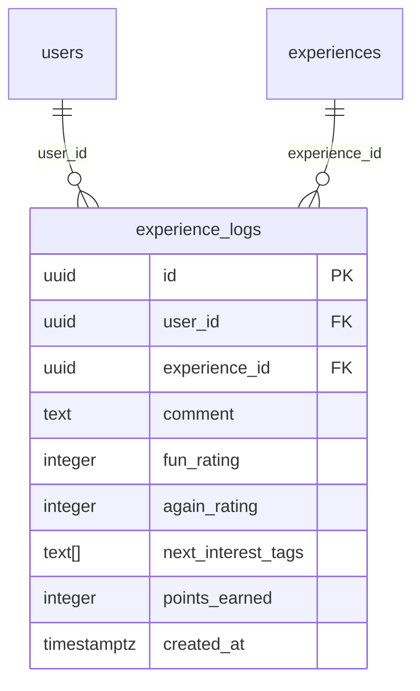

# experience_logs

## Description

体験会参加後のログ。感想・評価・次に気になるジャンルを記録する。

<details>
<summary><strong>Table Definition</strong></summary>

```sql
CREATE TABLE experience_logs (
  id uuid PRIMARY KEY DEFAULT gen_random_uuid(),
  user_id uuid NOT NULL REFERENCES users(id) ON DELETE CASCADE,
  experience_id uuid NOT NULL REFERENCES experiences(id) ON DELETE CASCADE,
  comment text,
  fun_rating integer CHECK (fun_rating BETWEEN 1 AND 5),
  again_rating integer CHECK (again_rating BETWEEN 1 AND 5),
  next_interest_tags text[],
  points_earned integer NOT NULL DEFAULT 0,
  created_at timestamptz NOT NULL DEFAULT now()
);
```

</details>

## Columns

| Name | Type | Default | Nullable | Children | Parents | Comment |
| ---- | ---- | ------- | -------- | -------- | ------- | ------- |
| id | uuid | gen_random_uuid() | false | | | |
| user_id | uuid | | false | | [users](users.md) | |
| experience_id | uuid | | false | | [experiences](experiences.md) | |
| comment | text | | true | | | 感想 |
| fun_rating | integer | | true | | | 楽しさ評価（1-5） |
| again_rating | integer | | true | | | また行きたい度（1-5） |
| next_interest_tags | text[] | | true | | | 次に気になるジャンル |
| points_earned | integer | 0 | false | | | このログで獲得したポイント |
| created_at | timestamptz | now() | false | | | |

## Constraints

| Name | Type | Definition |
| ---- | ---- | ---------- |
| experience_logs_pkey | PRIMARY KEY | PRIMARY KEY (id) |
| experience_logs_user_id_fkey | FOREIGN KEY | FOREIGN KEY (user_id) REFERENCES users(id) ON DELETE CASCADE |
| experience_logs_experience_id_fkey | FOREIGN KEY | FOREIGN KEY (experience_id) REFERENCES experiences(id) ON DELETE CASCADE |
| experience_logs_fun_rating_check | CHECK | CHECK (fun_rating BETWEEN 1 AND 5) |
| experience_logs_again_rating_check | CHECK | CHECK (again_rating BETWEEN 1 AND 5) |

## RLS Policies

| Name | Command | Definition |
| ---- | ------- | ---------- |
| public read | SELECT | using (true) |
| owner insert | INSERT | with check (auth.uid() = user_id) |

## Relations


