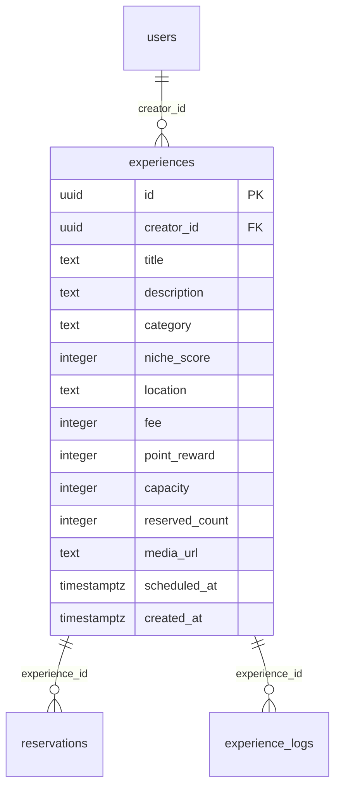

# experiences

## Description

体験会情報。ユーザーが投稿・閲覧・予約する体験会を管理する。

<details>
<summary><strong>Table Definition</strong></summary>

```sql
CREATE TABLE experiences (
  id uuid PRIMARY KEY DEFAULT gen_random_uuid(),
  creator_id uuid NOT NULL REFERENCES users(id) ON DELETE CASCADE,
  title text NOT NULL,
  description text,
  category text NOT NULL,
  niche_score integer NOT NULL DEFAULT 50,
  location text,
  fee integer NOT NULL DEFAULT 0,
  point_reward integer NOT NULL DEFAULT 100,
  capacity integer NOT NULL DEFAULT 10,
  reserved_count integer NOT NULL DEFAULT 0,
  media_url text,
  scheduled_at timestamptz,
  created_at timestamptz NOT NULL DEFAULT now()
);
```

</details>

## Columns

| Name | Type | Default | Nullable | Children | Parents | Comment |
| ---- | ---- | ------- | -------- | -------- | ------- | ------- |
| id | uuid | gen_random_uuid() | false | [reservations](reservations.md) [experience_logs](experience_logs.md) | | |
| creator_id | uuid | | false | | [users](users.md) | 投稿者 |
| title | text | | false | | | タイトル |
| description | text | | true | | | 説明 |
| category | text | | false | | | カテゴリ（好奇心クラスタ） |
| niche_score | integer | 50 | false | | | ニッチ度（0-100） |
| location | text | | true | | | 開催場所 |
| fee | integer | 0 | false | | | 参加費（円） |
| point_reward | integer | 100 | false | | | 参加で得られるポイント |
| capacity | integer | 10 | false | | | 定員 |
| reserved_count | integer | 0 | false | | | 現在の予約数 |
| media_url | text | | true | | | カバー画像URL |
| scheduled_at | timestamptz | | true | | | 開催日時 |
| created_at | timestamptz | now() | false | | | |

## Constraints

| Name | Type | Definition |
| ---- | ---- | ---------- |
| experiences_pkey | PRIMARY KEY | PRIMARY KEY (id) |
| experiences_creator_id_fkey | FOREIGN KEY | FOREIGN KEY (creator_id) REFERENCES users(id) ON DELETE CASCADE |

## RLS Policies

| Name | Command | Definition |
| ---- | ------- | ---------- |
| public read | SELECT | using (true) |
| owner insert | INSERT | with check (auth.uid() = creator_id) |
| owner update | UPDATE | using (auth.uid() = creator_id) |

## Relations


