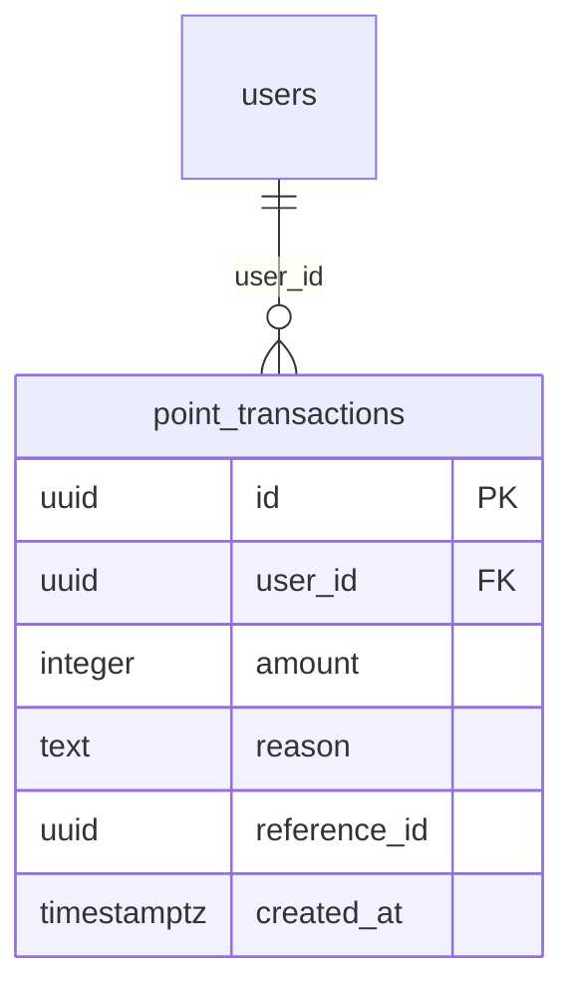

# point_transactions

## Description

ポイント獲得・消費の履歴。`users.points` の根拠となるレコードを管理する。

<details>
<summary><strong>Table Definition</strong></summary>

```sql
CREATE TABLE point_transactions (
  id uuid PRIMARY KEY DEFAULT gen_random_uuid(),
  user_id uuid NOT NULL REFERENCES users(id) ON DELETE CASCADE,
  amount integer NOT NULL,
  reason text NOT NULL,
  reference_id uuid,
  created_at timestamptz NOT NULL DEFAULT now()
);
```

</details>

## Columns

| Name | Type | Default | Nullable | Children | Parents | Comment |
| ---- | ---- | ------- | -------- | -------- | ------- | ------- |
| id | uuid | gen_random_uuid() | false | | | |
| user_id | uuid | | false | | [users](users.md) | |
| amount | integer | | false | | | 変動ポイント（正: 獲得、負: 消費） |
| reason | text | | false | | | 獲得・消費理由 |
| reference_id | uuid | | true | | | 関連リソースID（experience_id 等） |
| created_at | timestamptz | now() | false | | | |

## Constraints

| Name | Type | Definition |
| ---- | ---- | ---------- |
| point_transactions_pkey | PRIMARY KEY | PRIMARY KEY (id) |
| point_transactions_user_id_fkey | FOREIGN KEY | FOREIGN KEY (user_id) REFERENCES users(id) ON DELETE CASCADE |

## RLS Policies

| Name | Command | Definition |
| ---- | ------- | ---------- |
| owner read | SELECT | using (auth.uid() = user_id) |

## Relations


