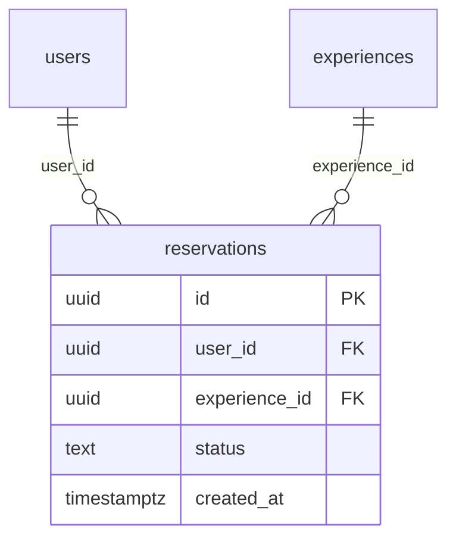

# reservations

## Description

体験会の予約情報。同一ユーザーが同一体験会に重複予約できないよう UNIQUE 制約あり。

<details>
<summary><strong>Table Definition</strong></summary>

```sql
CREATE TABLE reservations (
  id uuid PRIMARY KEY DEFAULT gen_random_uuid(),
  user_id uuid NOT NULL REFERENCES users(id) ON DELETE CASCADE,
  experience_id uuid NOT NULL REFERENCES experiences(id) ON DELETE CASCADE,
  status text NOT NULL DEFAULT 'reserved' CHECK (status IN ('reserved', 'joined', 'cancelled')),
  created_at timestamptz NOT NULL DEFAULT now(),
  UNIQUE (user_id, experience_id)
);
```

</details>

## Columns

| Name | Type | Default | Nullable | Children | Parents | Comment |
| ---- | ---- | ------- | -------- | -------- | ------- | ------- |
| id | uuid | gen_random_uuid() | false | | | |
| user_id | uuid | | false | | [users](users.md) | |
| experience_id | uuid | | false | | [experiences](experiences.md) | |
| status | text | 'reserved' | false | | | reserved / joined / cancelled |
| created_at | timestamptz | now() | false | | | |

## Constraints

| Name | Type | Definition |
| ---- | ---- | ---------- |
| reservations_pkey | PRIMARY KEY | PRIMARY KEY (id) |
| reservations_user_id_fkey | FOREIGN KEY | FOREIGN KEY (user_id) REFERENCES users(id) ON DELETE CASCADE |
| reservations_experience_id_fkey | FOREIGN KEY | FOREIGN KEY (experience_id) REFERENCES experiences(id) ON DELETE CASCADE |
| reservations_user_id_experience_id_key | UNIQUE | UNIQUE (user_id, experience_id) |
| reservations_status_check | CHECK | CHECK (status IN ('reserved', 'joined', 'cancelled')) |

## RLS Policies

| Name | Command | Definition |
| ---- | ------- | ---------- |
| owner read | SELECT | using (auth.uid() = user_id) |
| owner insert | INSERT | with check (auth.uid() = user_id) |

## Relations


