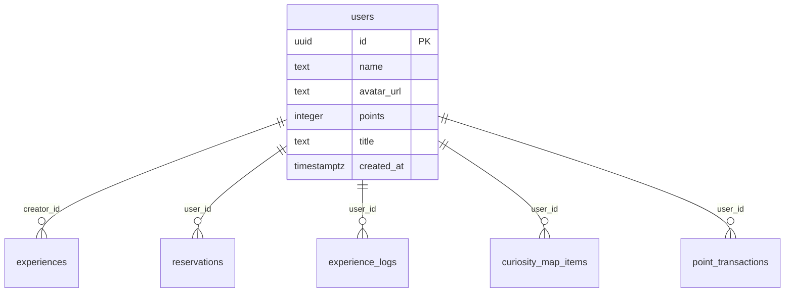

# users

## Description

ユーザー情報。Supabase Auth の `auth.users` と 1:1 で紐づく。

<details>
<summary><strong>Table Definition</strong></summary>

```sql
CREATE TABLE users (
  id uuid PRIMARY KEY REFERENCES auth.users(id) ON DELETE CASCADE,
  name text NOT NULL DEFAULT 'ゲスト',
  avatar_url text,
  points integer NOT NULL DEFAULT 0,
  title text NOT NULL DEFAULT '好奇心の芽',
  created_at timestamptz NOT NULL DEFAULT now()
);
```

</details>

## Columns

| Name | Type | Default | Nullable | Children | Parents | Comment |
| ---- | ---- | ------- | -------- | -------- | ------- | ------- |
| id | uuid | | false | [experiences](experiences.md) [reservations](reservations.md) [experience_logs](experience_logs.md) [curiosity_map_items](curiosity_map_items.md) [point_transactions](point_transactions.md) | auth.users | Supabase Auth ユーザーID |
| name | text | 'ゲスト' | false | | | 表示名 |
| avatar_url | text | | true | | | アバター画像URL |
| points | integer | 0 | false | | | 累計ポイント |
| title | text | '好奇心の芽' | false | | | 称号 |
| created_at | timestamptz | now() | false | | | |

## Constraints

| Name | Type | Definition |
| ---- | ---- | ---------- |
| users_pkey | PRIMARY KEY | PRIMARY KEY (id) |
| users_id_fkey | FOREIGN KEY | FOREIGN KEY (id) REFERENCES auth.users(id) ON DELETE CASCADE |

## RLS Policies

| Name | Command | Definition |
| ---- | ------- | ---------- |
| public read | SELECT | using (true) |
| owner insert | INSERT | with check (auth.uid() = id) |
| owner update | UPDATE | using (auth.uid() = id) |

## Relations


