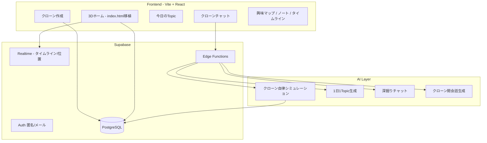
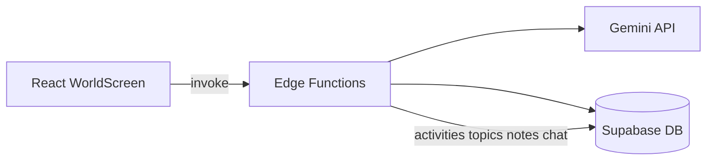

# 放置me — 実装プラン（Hackathon 2026/05）

> **プロダクト名**: 放置me  
> **コピー**: あなたのクローンが、知らない自分を見つけてくる。 / 放置しておくほど、あなたが広がる。  
> **モック（正）**: リポジトリ直下 [`index.html`](../index.html) — UI・3D・デザイントークンはここを唯一の参照源とする  
> **設計書**: 本ドキュメント冒頭のプロダクト設計（2026-05 版）

---

## 0. 現状と方針

| 項目 | 内容 |
|------|------|
| 旧プロダクト | Curio Meet（体験会フィード・予約）— `frontend/` に React + Supabase 実装あり |
| 新プロダクト | 放置me — クローンAI × 3D「叡智の図書館」× 1日1Topic |
| モック | `index.html`（Three.js r128、単一HTML、Clone OS v2 UI） |
| 実装方針 | **見た目・3Dはモック移植を最優先**。データ・AI・認証は Supabase を継続利用しスキーマを置き換え |

### 0.1 モックから移植するもの（チェックリスト）

- [x] CSS 変数（`--neon-cyan`, `--bg-0` 等）と glass UI → `frontend/src/styles/world.css`
- [x] グリッドレイアウト: `topbar / sidebar(280) / main / right(340) / command` → `WorldScreen.jsx`
- [x] 3D: 叡智の図書館（半透明書架・中央デスク・天窓・集会場相当の空間） → `initLibraryScene.js`
- [x] アバター: Mira / Sage / Echo パレット、吹き出し、名前タグ
- [x] ウェイポイント巡回 + HUD 連動（座標・速度・現地時刻・パンくず）
- [x] カメラ4種: 追従 / 軌道 / 俯瞰 / シネマ
- [x] ミニマップ（2D canvas）
- [x] 右パネル: いま / 今日のタイムライン / クローン統計（**データはダミー**）
- [x] 左サイド: クローンカード・バイタル・ワールド・ページツリー

### 0.3 現在地（Milestone A 完了 — 2026-05-25）

**デプロイ可能なデモ**まで到達済み。`frontend/` を `npm run dev` / Vercel で開ける。

| 領域 | 状態 | 主なファイル |
|------|------|----------------|
| 3D + UI シェル | 完了 | `WorldScreen.jsx`, `initLibraryScene.js`, `world.css` |
| クローン操作 | **一部完了**（放置／手動 + WASD） | HO-219, HO-220。クリック移動は未 |
| クローン作成 | **LocalStorage のみ** | `OnboardingModal.jsx`, `hochiDummy.js` |
| Topic / チャット / ノート | **オーバーレイ + 固定ダミー** | `WorldScreen.jsx` 内 overlay |
| Supabase / AI | **未着手** | 旧 Curio スキーマ・画面は残存 |
| **Gemini / エージェント LLM** | **未着手（設計のみ §3・Phase AI）** | 現状は `hochiDummy.js` 固定文 |
| デプロイ | `vercel.json` 追加済み | `frontend/vercel.json` |

**まだ Must として未達のもの**: DB 永続化、**Gemini API によるクローンエージェント**（Topic・チャット・1日シミュレーション）、毎日の質問、興味マップ・ノート・タイムラインの専用画面と API 連携。**Milestone A のダミー表示は Phase AI で置き換える。**

### 0.4 ここから取り組むタスク（推奨順）

> 着手前は [rule.md](./rule.md) で **LINE 担当宣言** → ブランチ `feat/ho-xxx-...` → PR 時に §10 のチェックを更新。

#### スプリント 1 — データ基盤（最優先・並行可）

バックエンドがないと以降の Must がすべてダミーのままになる。**HO-101 → HO-102 → HO-104** を先に通す。

| 順 | ID | やること | 完了の目安 |
|----|-----|----------|------------|
| 1 | **HO-101** | 放置me 用マイグレーション + RLS | `clones`, `clone_activities`, `daily_topics`, `notes` 等が作成される |
| 2 | **HO-102** | シード（叡智の図書館・4ロケーション・NPC Sage/Echo） | ローカル Supabase で参照データが入る |
| 3 | **HO-104** | オンボーディング → `clones` + `clone_profiles` を Supabase に保存 | LocalStorage から DB へ移行 |
| 4 | **HO-105** | 未作成クローン時はオンボーディングへ（現状ロジックの DB 版） | 新規ユーザーで DB に clone が無いと作成画面 |

#### スプリント 1.5 — Gemini API・クローンエージェント（LLM 基盤）**【ダミー置換の本体】**

DB（HO-101）と並行または直後に実施。**API キーは Supabase Edge Functions の Secret のみ**（`GEMINI_API_KEY`）。フロントにキーを置かない。

| 順 | ID | やること | 完了の目安 |
|----|-----|----------|------------|
| 5 | **HO-110** | Gemini API 接続基盤（共通クライアント・モデル・エラーハンドリング） | `functions/_shared/gemini.ts` から 1 回呼べる |
| 6 | **HO-111** | クローンエージェント共通層（人格 system prompt・コンテキスト組み立て） | `clone_profiles` + 直近 activities を渡して応答が一貫 |
| 7 | **HO-112** | FE: `invokeCloneApi` ラッパー + **ダミーはフォールバックのみ** | `hochiDummy.js` を本番経路から外す |
| 8 | **HO-113** | **`clone-chat`**（Gemini・会話履歴・`chat_messages` 保存） | チャット送信 → クローン口調で返答（§HO-401） |
| 9 | **HO-114** | **`simulate-clone-day`**（エージェント風：1日分 activities → Topic → notes） | 「今日を要約」で DB に活動＋Topic が入る（§HO-301） |
| 10 | **HO-115** | **`encounter-dialogue`**（Sage/Echo 吹き出しを LLM 生成、任意で DB 保存） | 固定 `conversation[]` を LLM 会話に差し替え可 |
| 11 | **HO-116** | **`apply-daily-answers`**（回答を Gemini で解釈 → 同期率・vitals 更新） | 質問回答後に数値・探索バイアスが変わる（§HO-405） |
| 12 | **HO-117** | **ダミー UI 接続**：Topic オーバーレイ・チャット・「いま」文を API 結果表示 | `WorldScreen` / `TopicScreen` が `hochiDummy` 非依存 |

#### スプリント 2 — Must 機能の画面と API（FE + BE）

| 順 | ID | やること | 完了の目安 |
|----|-----|----------|------------|
| 13 | **HO-301** | `simulate-clone-day` の FE トリガー（「今日を要約」）+ 結果表示 | **HO-114** 実装を呼ぶ |
| 14 | **HO-302** + **HO-303** | 今日の Topic 専用画面 + フィードバック | **HO-117** で LLM 生成 Topic を表示 |
| 15 | **HO-205** + **HO-206** | 右パネル「いま」「タイムライン」を DB 購読 | `clone_activities`（HO-114 出力） |
| 16 | **HO-401** + **HO-402** | クローンチャット画面 + クイック質問チップ | **HO-113**（Gemini）を呼ぶ |
| 17 | **HO-404** + **HO-405** | 毎日の質問 UI + 回答送信 | **HO-116** を呼ぶ |
| 18 | **HO-304** + **HO-305** + **HO-306** | 興味マップ・ノート（**HO-114** で生成した `notes` を表示） | ナレッジベースが DB 駆動 |
| 19 | **HO-501** | タイムライン画面（日別・過去遡り） | 活動履歴が LLM 生成分を含む |

#### スプリント 2.5 — 3D 操作感（ユーザーがクローンを動かす）

現状は `initLibraryScene.js` の**ウェイポイント自動巡回のみ**（観察専用）。プロダクト体験として **「放置で動くクローン」** と **「自分で図書館を歩く」** の両方を用意する。

| 順 | ID | やること | 完了の目安 |
|----|-----|----------|------------|
| 19b | **HO-219** | **操作モード切替**（放置／手動）UI + 自動巡回の停止 | トグルでモードが切り替わる |
| 19c | **HO-220** | **キーボード操作**（WASD / 矢印）でクローン移動・歩行アニメ | 手動時に WASD で歩ける |
| — | **HO-221** | Should: **クリック移動**（床 Raycaster で目的地） | クリックした場所へ歩く |
| — | **HO-222** | Should: 手動中の **最寄りロケーション** を HUD に表示 | パンくずが「東の書架」等に追従 |
| — | **HO-223** | Could: モバイル用 **バーチャルスティック** | スマホでも移動可 |
| — | **HO-224** | 手動操作ログ → `clone_activities`（DB 後） | 歩いた軌跡をタイムラインに残す |

**体験の整理**

| モード | 操作 | プロダクト意味 |
|--------|------|----------------|
| **放置**（デフォルト） | 見るだけ。クローンが自律巡回 | 「放置している間に探索してくれる」 |
| **手動** | WASD 等で自分のクローンを操作 | 「図書館を覗き見しながら、自分でも歩いてみる」 |

#### スプリント 3 — 仕上げ・発表（Should / インフラ）

| 順 | ID | やること | 備考 |
|----|-----|----------|------|
| 20 | **HO-103** | オンボーディングを設計書どおり項目拡充 | HO-104 後でも可 |
| 21 | **HO-403** + **HO-118** | コマンドバー → Gemini 指示パース or チャット | 「西の書架へ」デモ |
| 24 | **HO-502** ~ **HO-506** | フレンド・出会い・性格再設定 | Should |

#### スプリント 4 — デプロイ・インフラ（HO-601 系）

| 順 | ID | やること | 完了の目安 |
|----|-----|----------|------------|
| 27 | **HO-601** | Vercel Production URL 確定・README / 提出欄に記載 | 審査員が URL だけでデモ可能 |
| 28 | **HO-606** | Vercel プロジェクト設定（Root=`frontend`、Framework=Vite、本番ブランチ`main`） | ダッシュボードとリポ設定一致 |
| 29 | **HO-607** | 環境変数（`VITE_SUPABASE_*`、必要なら Preview 用） | 本番ビルドが通る |
| 30 | **HO-608** | Supabase Edge Secrets（`GEMINI_API_KEY` 等）とデプロイ手順 doc | BE 関数が本番で動く |
| 31 | **HO-609** | `main` push 後の Production 動作確認チェックリスト | 3D・オンボ・LLM の smoke |
| 32 | **HO-610** | PR Preview 運用（`cd.yml`）の URL を PR に貼るルール化 | レビュー時に確認 |

#### スプリント 4 — デザイン・UI 整理（HO-701 系）

| 順 | ID | やること | 完了の目安 |
|----|-----|----------|------------|
| 33 | **HO-701** | デザイン基準 doc（`index.html` との差分チェックリスト） | `project-docs/design-guide.md` |
| 34 | **HO-702** | `WorldScreen` コンポーネント分割（§HO-003） | `components/world/*` |
| 35 | **HO-703** | オンボーディング・モーダルのビジュアル統一（glass / neon） | ワールド画面とトーン一致 |
| 36 | **HO-704** | Topic / Chat / 設定系オーバーレイの UI 統一 | 同じパネル・ボタン・タイポ |
| 37 | **HO-705** | レイアウト整理（パネル幅・重なり・操作パネル位置） | 右操作パネルとカメラ HUD の干渉解消 |
| 38 | **HO-706** | ローディング / エラー / 空状態（LLM・API 待ち） | スピナー・再試行・フォールバック表示 |
| 39 | **HO-707** | 旧 Curio Meet 画面・未使用 CSS の整理 | ビルド対象から外す or 削除 |
| 40 | **HO-708** | タイポ・コピー統一（放置me、サブコピー、ボタン文言） | README・UI 文言一致 |
| 41 | **HO-709** | Should: 狭い画面・タブレットの最低限対応 | 横スクロール or パネル折りたたみ |
| 42 | **HO-710** | Should: アクセシビリティ（フォーカス、aria、キーボード操作ヒント） | 手動操作と整合 |

#### スプリント 4 — 提出物（全員）

| 順 | ID | やること | 備考 |
|----|-----|----------|------|
| 43 | **HO-602** | 発表用シナリオ doc（3分） | PM |
| 44 | **HO-603** | スクリーンショット 2枚 → `docs/` | 全員 |
| 45 | **HO-604** | Could: バッジ・ランキング UI | FE |
| 46 | **HO-605** | Could: 複数ワールド切替 UI | FE |

#### いま担当を取りやすいタスク（単独で切り出し可能）

| ID | 一人で完結しやすい | ブロッカー |
|----|-------------------|-----------|
| HO-101 | ◎ | なし |
| HO-102 | ◎（HO-101 後） | HO-101 |
| HO-110 | ◎ | `GEMINI_API_KEY`（Secret） |
| HO-111 | ◎（HO-110 後） | HO-110 |
| HO-113 | ○（HO-111・DB 任意） | HO-110, HO-111 |
| HO-114 | ○（HO-101・111 後） | HO-101, HO-111 |
| HO-219 | ◎（DB 不要） | なし |
| HO-220 | ◎（HO-219 と同時） | なし |
| HO-302 | ○（UI 先、HO-117 で LLM 接続） | HO-117 推奨 |
| HO-304 | ○ | なし |
| HO-501 | ○ | なし |
| HO-601 | ◎ | `main` push 権限 |
| HO-602 | ◎ | なし |

#### 意図的に後回し（Milestone A で十分なもの）

- **HO-006**（`@react-three/fiber`）— 現状の vanilla Three で問題なし
- **HO-005**（Bloom）— オプション。パフォーマンス優先ならスキップ可
- **HO-208**, **HO-202**, **HO-203** — 3D 上は **実装済み**（追加作業は DB 連携のみ）
- 旧 Curio 画面削除 — ビルドに影響しないため **HO-501 以降**でまとめて削除可

### 0.2 MVP 優先度（設計書 §19 対応）

| 優先 | 機能 |
|------|------|
| **Must** | クローン作成、3Dワールドビュー、今日のTopic、理由説明、クローンチャット、毎日の質問、興味マップ、ノート、タイムライン |
| **Should** | 他クローン吹き出し、フレンド、ユーザー間会話、性格変更、ロケーション選好、カメラ切替、ミニマップ、**クローン手動操作（放置／操作モード）** |
| **Could** | 音声入力、ランキング、共有カード、リアルタイム会話、複数ワールド、外見カスタム、SNS連携 |

---

## 1. アーキテクチャ



### 1.1 技術スタック（確定案）

| 層 | 選定 | 備考 |
|----|------|------|
| フロント | React 18 + Vite + Tailwind（既存） | 3D は `@react-three/fiber` + `three@0.128` **または** `index.html` の Three モジュールを `frontend/src/world/` に分割移植 |
| 3D | Three.js r128（モックと同版） | Bloom は optional（モック同様フォールバック） |
| バック | Supabase（Auth / DB / Realtime / Edge Functions） | 旧 Curio テーブルは非推奨・新マイグレーションで置換 |
| AI | **Google Gemini API**（例: `gemini-2.0-flash` / `gemini-1.5-flash`）— Edge Functions から呼び出し | 審査用に `AI_USAGE_LOG.md` へ記録必須。キーは `GEMINI_API_KEY` |
| インフラ | Vercel（FE）+ Supabase Cloud | 既存 Docker/nginx は維持可 |

### 1.2 画面ルーティング（MVP）

| パス / 画面 ID | 画面 | モック対応 |
|----------------|------|------------|
| `/onboarding` | クローン作成 | — |
| `/` または `/world` | ホーム＝仮想世界ビュー | `index.html` 全体 |
| `/topic/today` | 今日のTopic | 設計書 §14 |
| `/chat` | クローンチャット | コマンドバー + 専用画面 |
| `/map` | 興味マップ | 旧 curiosity_map の置換 |
| `/notes`, `/notes/:id` | ナレッジベース | 左「ページ」ツリー |
| `/timeline` | 履歴（右パネル拡張） | `#timeline` |
| `/friends` | フレンド・出会い | Should |

---

## 2. データモデル（Supabase）

旧スキーマ（`experiences`, `reservations` 等）は **参照のみ**。新規マイグレーション `backend/supabase/migrations/YYYYMMDD_hochi_me_schema.sql` で追加。

### 2.1 コアテーブル

| テーブル | 用途 | 主要カラム |
|----------|------|------------|
| `users` | 人間ユーザー | 既存流用 + `display_name` |
| `clones` | 1ユーザー1クローン（MVP） | `user_id`, `name`, `mbti`, `archetype`, `sync_rate`, `vitals` jsonb, `appearance` jsonb |
| `clone_profiles` | 初回入力・性格オフセット | `likes`, `recent_interests`, `bio`, `ideal_self`, `personality_shift`, `dislikes` |
| `worlds` | 叡智の図書館 等 | `slug`, `name`, `is_default` |
| `locations` | 中央デスク / 東の書架 等 | `world_id`, `slug`, `name`, `position` jsonb |
| `clone_activities` | タイムライン1行 | `clone_id`, `location_id`, `activity_type`, `summary`, `metadata` jsonb, `occurred_at` |
| `daily_topics` | 1日1Topic | `clone_id`, `topic_date`, `title`, `reason`, `source_activity_ids` uuid[] |
| `notes` | クローン執筆ノート | `clone_id`, `parent_id`, `title`, `body`, `tags` |
| `note_links` | バックリンク | `from_note_id`, `to_note_id` |
| `interest_map_nodes` | 興味マップ | `clone_id`, `label`, `kind`, `depth`, `source` |
| `clone_encounters` | 他クローンとの出会い | `clone_a_id`, `clone_b_id`, `location_id`, `dialogue` jsonb, `cross_topic` |
| `friendships` | フレンド | `user_a_id`, `user_b_id`, `status` |
| `chat_messages` | ユーザー↔クローン | `clone_id`, `role`, `content`, `channel` |
| `daily_questions` | マスタ質問 | `question_key`, `text`, `sort_order` |
| `daily_question_answers` | 回答 | `clone_id`, `question_id`, `answer`, `answered_at` |

### 2.2 RLS 方針

- 自分の `clone` / `notes` / `activities` / `chat` のみ CRUD
- `clone_encounters`: 当事者クローンのオーナーのみ read
- デモ用: シードに Sage / Echo 相当の **NPC クローン** を2体投入（モックの会話再現）

### 2.3 Realtime（Should）

- チャンネル `clone:{id}` — 最新 `clone_activities` 1件、`vitals`、現在 `location_id`
- フロントの「いま」カード・ミニマップ・HUD を購読で更新

---

## 3. AI / バックエンドジョブ（Gemini・エージェント）

### 3.1 方針

- **プロバイダ**: Google **Gemini API**（チーム方針。実装タスクは Phase AI `HO-110`〜）
- **実行場所**: Supabase **Edge Functions**（Deno）。フロントは `supabase.functions.invoke` のみ
- **エージェント像**: 単発 completion ではなく、**クローン人格（system）+ 記憶コンテキスト（user/data）+ タスク別指示** で「放置中に探索しているクローン」として振る舞う
- **ダミー**: [`hochiDummy.js`](../frontend/src/data/hochiDummy.js) は **API 失敗時・オフライン開発用フォールバック** に降格（`HO-112`）



### 3.2 エージェント別ジョブ（Edge Function）

| 関数 | タスク ID | トリガー | エージェント的な動き | 出力 |
|------|-----------|----------|----------------------|------|
| `clone-chat` | HO-113 / HO-401 | ユーザー送信・クイック質問 | クローン人格で深掘り応答。履歴を `chat_messages` から再注入 | 返答テキスト + DB 保存 |
| `simulate-clone-day` | HO-114 / HO-301 | 「今日を要約」・デモボタン | **1日シミュレーション**: ロケーション巡回 → 読書/執筆/思索の活動ログ → 他クローン遭遇 → **1 Topic 選定** → 関連ノート下書き | `clone_activities` 複数、`daily_topics` 1、`notes` 複数 |
| `encounter-dialogue` | HO-115 / HO-208 | 集会場・NPC 近接（または手動） | 2 クローンの偏愛を交差させた短い対話（3D 吹き出し用） | `clone_encounters.dialogue` + `cross_topic` |
| `apply-daily-answers` | HO-116 / HO-405 | 毎日の質問送信 | 回答を解釈し同期率・vitals・探索重みを更新 | `clones` 更新 |
| `parse-clone-command` | HO-118 / HO-403 | コマンドバー送信 | 「西の書架へ」等を intent + 短い応答に分解（任意） | フロントへ JSON |

### 3.3 共通実装（`HO-110` / `HO-111`）

| モジュール | パス（案） | 内容 |
|------------|------------|------|
| Gemini クライアント | `backend/supabase/functions/_shared/gemini.ts` | `fetch` で Generative Language API、`generateContent` / ストリーム（可能なら） |
| コンテキスト | `_shared/cloneContext.ts` | `clone` + `clone_profiles` + 直近 `activities` / `daily_topics` / `interest_map_nodes` をプロンプト用 JSON に整形 |
| 人格プロンプト | `_shared/prompts/clonePersona.ts` | MBTI・好きなもの・性格シフト・「なりたい自分」を反映した system 文 |
| JSON 出力 | 各 EF 内 | Topic 生成などは `responseMimeType: application/json` で構造化（Gemini の JSON モード） |

**プロンプト設計の要点**

- 入力: `clone_profiles` + 直近7日 `clone_activities` + 既存 `interest_map_nodes`
- 性格シフト（反転型等）: ロケーション重み・行動タイプを system に明示（設計書 §9）
- Topic 理由: **行動経路を必ず含める**（設計書 §14 の例文構造）。`simulate-clone-day` の最終ステップで検証
- コスト抑制: デモは 1 日 1 回の `simulate-clone-day` + チャット数回に抑える（`AI_USAGE_LOG` にトークン記録）

### 3.4 ダミー表示 → LLM 置き換えマップ（`HO-117`）

| 現状（Milestone A） | 置き換え後 | 担当タスク |
|---------------------|------------|------------|
| `TODAY_TOPIC` 固定文 | `daily_topics`（HO-114 生成） | HO-117, HO-302 |
| チャット overlay 1 件固定 | `clone-chat` ストリーム/全文 | HO-113, HO-402 |
| 右パネル「いま」固定文 | 最新 `clone_activity` または simulate 中間結果 | HO-205, HO-114 |
| タイムライン初期配列 | 当日 `clone_activities` 一覧 | HO-206, HO-114 |
| 3D `conversation[]` 固定 | `encounter-dialogue` 生成 or ローテーション | HO-115, HO-208 |
| コマンドバー未接続 | `clone-chat` or `parse-clone-command` | HO-403, HO-118 |

---

## 4. フェーズとスケジュール（3日間想定）

| Day | ゴール | デモで見せるもの |
|-----|--------|------------------|
| **Day 1** | モック移植 + クローン作成 + DB 新規 | `index.html` 相当の 3D が React で動く。オンボーディング完了で Mira 表示 |
| **Day 2** | Must のデータ連携 + Topic + チャット + タイムライン | 今日のTopic・理由・関連ノートが DB/AI から出る。質問1セット回答で同期率変化 |
| **Day 3** | Should 一部 + 仕上げ + デプロイ | 他クローン吹き出し、フレンド一覧、発表用シナリオ通し |

---

## 5. タスク一覧

タスク ID は **`HO-xxx`**（放置me）。着手前に [rule.md](./rule.md) の担当宣言・ブランチ命名に従う。

凡例: `[Must]` / `[Should]` / `[Could]` — 設計書 §19

### Phase A — 基盤・モック移植（Day 1 AM）

| ID | 優先 | タスク | 成果物 | 担当目安 |
|----|------|--------|--------|----------|
| HO-001 | — | README / チーム情報を放置me に更新 | `README.md` | PM |
| HO-002 | — | デザイントークンを Tailwind + CSS 変数化 | `frontend/src/styles/tokens.js`, `index.css` | FE |
| HO-003 | Must | `index.html` のレイアウトを React シェルに移植（3D除く） | `WorldLayout.jsx`, 各パネルコンポーネント | FE |
| HO-004 | Must | Three.js シーンを `frontend/src/world/` にモジュール分割 | `LibraryScene.jsx`, `avatars.js`, `waypoints.js` | FE |
| HO-005 | Must | ローダー・CDN フォールバック・Bloom 任意読込（モック同等） | モック `__mira` パターン踏襲 | FE |
| HO-006 | — | `three`, `@react-three/fiber`, `@react-three/drei` 依存追加 | `package.json` | FE / Infra |

### Phase AI — Gemini API・クローンエージェント（LLM）**【ダミー→本番応答】**

| ID | 優先 | タスク | 成果物 | 担当目安 |
|----|------|--------|--------|----------|
| HO-110 | Must | Gemini API 基盤（Secret `GEMINI_API_KEY`、共通クライアント） | `functions/_shared/gemini.ts` | BE |
| HO-111 | Must | クローンエージェント共通層（persona + `buildCloneContext`） | `_shared/cloneContext.ts`, `prompts/clonePersona.ts` | BE |
| HO-112 | Must | FE API ラッパー・ダミーはフォールバックのみ | `frontend/src/lib/cloneApi.js` | FE |
| HO-113 | Must | EF `clone-chat`（Gemini・`chat_messages`） | `functions/clone-chat/` | BE |
| HO-114 | Must | EF `simulate-clone-day`（1日シミュレーション → Topic/notes/activities） | `functions/simulate-clone-day/` | BE |
| HO-115 | Should | EF `encounter-dialogue`（吹き出し会話・交差 Topic） | `functions/encounter-dialogue/` | BE |
| HO-116 | Must | EF `apply-daily-answers`（Gemini で回答解釈 → 同期率等） | `functions/apply-daily-answers/` | BE |
| HO-117 | Must | Topic/チャット/いま/タイムラインの **ダミー除去**・EF 結果を UI にバインド | `WorldScreen`, `TopicScreen`, `ChatScreen` | FE |
| HO-118 | Should | EF `parse-clone-command`（自然言語指示） | `functions/parse-clone-command/` | BE |

### Phase B — クローン作成・DB（Day 1 PM）

| ID | 優先 | タスク | 成果物 | 担当目安 |
|----|------|--------|--------|----------|
| HO-101 | Must | 新スキーママイグレーション + RLS | `migrations/*_hochi_me_schema.sql` | BE |
| HO-102 | Must | シード: 叡智の図書館、4ロケーション、NPC Sage/Echo | `seed.sql` | BE |
| HO-103 | Must | クローン作成画面（設計書 §7, §8） | `OnboardingScreen.jsx` | FE |
| HO-104 | Must | 作成 API: `clones` + `clone_profiles` insert | Supabase client or EF | BE |
| HO-105 | Must | 未作成時は `/onboarding` へリダイレクト | `App.jsx` ルーティング | FE |

### Phase C — 3D ホーム・ライブ UI（Day 1–2）

| ID | 優先 | タスク | 成果物 | 担当目安 |
|----|------|--------|--------|----------|
| HO-201 | Must | 自分のクローンのみ巡回（ウェイポイント → HUD 連動） | モック `updateUIForWaypoint` 相当 | FE |
| HO-202 | Should | カメラ4モード切替 | `#cam-follow` 等 | FE |
| HO-203 | Should | ミニマップ（全クローン位置・発話者パルス） | `#minimap` | FE |
| HO-204 | Must | 左: クローンカード・バイタル・同期率表示 | DB `clones.vitals`, `sync_rate` | FE |
| HO-205 | Must | 右: 「いま」— 現在 activity を表示 | `clone_activities` 最新1件 | FE |
| HO-206 | Must | 右: 今日のタイムライン一覧 | 当日 `clone_activities` | FE |
| HO-207 | Must | 下部コマンドバー UI（送信は Phase E で接続） | `CommandBar.jsx` | FE |
| HO-208 | Should | 他クローン吹き出し（固定スクリプト → **HO-115** LLM 会話へ差し替え可） | 3D `conversation[]` 連携 | FE / BE |

### Phase C2 — クローン操作感（ユーザー操作）

| ID | 優先 | タスク | 成果物 | 担当目安 |
|----|------|--------|--------|----------|
| HO-219 | Should | 放置／手動モード切替 + 自動巡回の一時停止 | `WorldScreen` トグル、`input.mode` | FE |
| HO-220 | Should | WASD・矢印でクローン移動（歩行アニメ・速度 HUD） | `initLibraryScene.js` | FE |
| HO-221 | Should | 床クリックで目的地移動（Raycaster） | クリックツール | FE |
| HO-222 | Should | 手動時に最寄りロケーション名を HUD 更新 | `waypoints` 距離判定 | FE |
| HO-223 | Could | モバイル・バーチャルスティック | タッチ UI | FE |
| HO-224 | Could | 手動移動を `clone_activities` に記録 | HO-101 後 | BE / FE |

### Phase D — 今日のTopic・興味マップ・ノート（Day 2）

| ID | 優先 | タスク | 成果物 | 担当目安 |
|----|------|--------|--------|----------|
| HO-301 | Must | 「今日を要約」等の FE トリガー → **HO-114**（Gemini simulate）を呼ぶ | ボタン + ローディング UI | FE |
| HO-302 | Must | 今日のTopic画面（タイトル・理由・関連ノート3） | `TopicScreen.jsx` | FE |
| HO-303 | Must | フィードバック UI: 気になる / 違う / もっと知りたい | `daily_topics` or `topic_feedback` | FE |
| HO-304 | Must | 興味マップ画面（種別・深さ・未解放） | `InterestMapScreen.jsx` | FE |
| HO-305 | Must | ノート一覧 + 詳細（Notion風簡易 Markdown） | `NotesScreen.jsx` | FE |
| HO-306 | Must | ページツリー ↔ `notes.parent_id` | 左サイドバー連動 | FE |
| HO-307 | Should | ナレッジベース / AIメモリーボールト / 目標の区分 | `notes.kind` 列追加 | BE |

### Phase E — チャット・毎日の質問・同期率（Day 2–3）

| ID | 優先 | タスク | 成果物 | 担当目安 |
|----|------|--------|--------|----------|
| HO-401 | Must | クローンチャット FE 完成 → **HO-113**（Gemini `clone-chat`）接続 | `ChatScreen` + invoke | FE |
| HO-402 | Must | クローンチャット画面 + クイック質問チップ | `ChatScreen.jsx` | FE |
| HO-403 | Must | コマンドバー → チャット or 指示パース（「西の書架へ」） | 簡易 intent → activity 予約 | FE / BE |
| HO-404 | Must | 毎日の質問マスタ + 回答 UI（5–6問） | `DailyQuestions.jsx` | FE |
| HO-405 | Must | 毎日の質問 FE → **HO-116**（Gemini `apply-daily-answers`）接続 | 回答後に同期率表示が変化 | FE / BE |
| HO-406 | Could | 音声入力（Web Speech API） | チャット画面 | FE |

### Phase F — タイムライン・フレンド・ユーザー会話（Day 3）

| ID | 優先 | タスク | 成果物 | 担当目安 |
|----|------|--------|--------|----------|
| HO-501 | Must | タイムライン画面（日別・過去遡り） | `TimelineScreen.jsx` | FE |
| HO-502 | Should | 出会ったクローン一覧 + 共通Topic | `FriendsScreen.jsx` | FE |
| HO-503 | Should | 「この人と話してみますか？」→ ユーザー間チャット | `user_chats` テーブル検討 | BE / FE |
| HO-504 | Should | フレンド追加・招待 | `friendships` | BE |
| HO-505 | Should | 性格シフト再設定 | オンボーディング編集モード | FE |
| HO-506 | Should | 行動タイプ（深掘り/拡散/社交/反転）→ ロケーション重み | `clone_profiles.exploration_mode` | BE |

### Phase G — デプロイ・インフラ・提出

| ID | 優先 | タスク | 成果物 | 担当（README 参照） |
|----|------|--------|--------|---------------------|
| HO-601 | Must | Production デモ URL 確定・README 記載 | デモ環境欄 | Infra |
| HO-606 | Must | Vercel プロジェクト設定（root=`frontend`） | ダッシュボード | Infra |
| HO-607 | Must | 本番環境変数 `VITE_SUPABASE_URL` / `ANON_KEY` | Vercel Env | Infra |
| HO-608 | Must | Edge Function Secrets 手順 + `GEMINI_API_KEY` | `project-docs/deploy.md` 等 | Infra + BE |
| HO-609 | Must | 本番 smoke テスト（3D・オンボ・主要導線） | チェックリスト | Infra + PM |
| HO-610 | Should | PR Preview URL の共有ルール | `rule.md` 追記 | Infra |
| HO-602 | Must | 発表用シナリオ（3分） | `demo-script.md` | PM |
| HO-603 | Must | スクリーンショット 2枚 | `docs/screenshot-*.png` | 全員（FE 編集） |
| HO-604 | Could | バッジ・ランキング UI | ゲーミフィケーション §18 | FE |
| HO-605 | Could | 複数ワールド切替 UI | 左ナビ | FE |

### Phase H — デザイン・UI 整理

| ID | 優先 | タスク | 成果物 | 担当（README 参照） |
|----|------|--------|--------|---------------------|
| HO-701 | Must | デザイン基準（モック準拠チェックリスト） | `design-guide.md` | PM + FE |
| HO-702 | Should | `WorldScreen` → `components/world/*` 分割 | §HO-003 | FE |
| HO-703 | Must | オンボーディング UI  polish | `OnboardingModal.jsx` | FE |
| HO-704 | Must | Topic / Chat / Notes オーバーレイ統一 | 各 Screen | FE + Full |
| HO-705 | Must | 3D ホーム HUD レイアウト整理（操作パネル・重なり） | `world.css` | FE |
| HO-706 | Must | LLM 待ち・エラー・再試行 UI | 共通コンポーネント | Full |
| HO-707 | Should | 旧 Curio コード・未使用 asset 削除 | `frontend/src/screens/*` | FE |
| HO-708 | Must | 文言・コピー統一（放置me） | 全画面 | PM + FE |
| HO-709 | Could | レスポンシブ最低限 | 768px 未満 | FE |
| HO-710 | Could | a11y（aria、フォーカス、操作ヒント） | キーボード操作と整合 | FE |

---

## 6. フロントコンポーネント構成（目標ツリー）

```
frontend/src/
├── App.jsx                 # ルート・認証・クローン有無判定
├── styles/
│   ├── tokens.js           # HO-002: モック CSS 変数
│   └── world.css           # glass / grid / timeline 等
├── screens/
│   ├── OnboardingScreen.jsx
│   ├── WorldScreen.jsx     # HO-003–207: ホーム（3D+オーバーレイ）
│   ├── TopicScreen.jsx
│   ├── ChatScreen.jsx
│   ├── InterestMapScreen.jsx
│   ├── NotesScreen.jsx
│   └── TimelineScreen.jsx
├── components/world/
│   ├── WorldLayout.jsx     # topbar / sidebar / right / command
│   ├── CloneCard.jsx
│   ├── VitalsBar.jsx
│   ├── NowCard.jsx
│   ├── ActivityTimeline.jsx
│   ├── CommandBar.jsx
│   └── CameraControls.jsx
└── world/                  # Three.js（index.html から移植）
    ├── LibraryScene.jsx
    ├── buildAvatar.js
    ├── waypoints.js
    └── minimap.js
```

---

## 7. デザイン仕様（モック準拠）

| トークン | 値 | 用途 |
|----------|-----|------|
| `--bg-0` | `#03040f` | 背景 |
| `--neon-cyan` | `#4ff5e7` | Mira アクセント |
| `--neon-violet` | `#a378ff` | ブランド |
| `--neon-pink` | `#ff6ec7` | Sage |
| `--neon-green` | `#74ffa8` | Echo |
| フォント | Inter + Noto Sans JP + JetBrains Mono | HUD・時刻 |

**アバター（Mira デフォルト）**: 紫×シアン、フード型、胸コア発光 — `PALETTES.mira` in `index.html`

**ロケーション slug（MVP）**

| slug | 表示名 | モック上のウェイポイント |
|------|--------|-------------------------|
| `central-desk` | 中央デスク | wp index 0, 5 |
| `east-shelf` | 東の書架 | wp index 1 |
| `skylight` | 天窓 / 観測所 | wp index 2 |
| `west-shelf` | 西の書架 | wp index 3 |
| `assembly` | 集会場 | 会話シーン（NPC 配置） |

---

## 8. 発表デモシナリオ（3分・推奨）

1. **オンボーディング** — ミサキ想定で Mira 作成、「少し外向的」選択  
2. **ホーム** — 3D で Mira が書架→デスクを巡回。Sage と吹き出し交差  
3. **今日のTopic** — 「カフェ巡り × フィルムカメラ」+ 理由（行動経路つき）  
4. **チャット** — 「なぜ興味を持ったの？」→ クローンが自分との関係を説明  
5. **毎日の質問** — 2問回答 → 同期率 99.6% → 99.8% など視覚的変化  
6. **タイムライン** — 「放置していた間にこう動いていた」一覧  
7. **クロージング** — コピー「あなたのクローンが、知らない自分を見つけてくる。」

---

## 9. リスクとカットライン

| リスク | 対策 | カット時 |
|--------|------|----------|
| Three.js 移植が重い | Day1 は `index.html` を iframe 埋め込みでも可 | 後から React 統合 |
| AI コスト / 遅延 | デモは `simulate-clone-day` 1回/日 + チャット数回に抑制 | ストリーミングは HO-113 で任意 |
| Gemini 未設定 | `HO-112` で `hochiDummy` フォールバック表示 | Secret 必須で本番 |
| リアルタイム複雑 | ポーリング 5s で代替 | Realtime |
| 旧 Curio コード混在 | `frontend/src/screens/*` を段階削除 | ビルド通過優先 |
| ユーザー間マッチング | フレンドはデモ2アカウント固定 | HO-503 |

**Day3 最低ライン（Must のみ）**: HO-101,104,110–114,117,201,204–206,301–306,401–405,501 + 3D（HO-004 任意）。**LLM なしデモは不可**（最低 HO-113 チャット + HO-114 Topic 生成）。

---

## 10. 進捗チェック（手動更新）

> **次に着手するタスクの一覧は §0.4 を参照。**

### Phase A — Milestone A（デモ実装）
- [x] HO-001（README・プロダクト名の一部）
- [x] HO-002
- [ ] HO-003（`WorldScreen` 単体のまま — コンポーネント分割は未）
- [ ] HO-004（`initLibraryScene.js` 単一ファイル — 分割は未）
- [x] HO-005（Bloom オフ・フォールバックで運用）
- [x] HO-006（`three@0.128.0` のみ。R3F は未導入）

### Phase B — **← データ基盤・ここから優先**
- [ ] HO-101
- [ ] HO-102
- [x] HO-103（簡易版 `OnboardingModal` — 設計書フル項目は未）
- [ ] HO-104
- [x] HO-105（LocalStorage 版）

### Phase AI — **← ダミー→Gemini（DB と並行可）**
- [ ] HO-110
- [ ] HO-111
- [ ] HO-112
- [ ] HO-113
- [ ] HO-114
- [ ] HO-115
- [ ] HO-116
- [ ] HO-117
- [ ] HO-118

### Phase C
- [x] HO-201
- [x] HO-202
- [x] HO-203
- [x] HO-204（表示のみ・DB 未連携）
- [ ] HO-205（ダミー / 3D コールバックのみ）
- [ ] HO-206（初期ダミー固定）
- [x] HO-207（UI のみ・送信未接続）
- [x] HO-208

### Phase C2 — クローン操作感
- [x] HO-219（放置／手動トグル・自動巡回停止）
- [x] HO-220（WASD・矢印・歩行アニメ・HUD 速度）
- [ ] HO-221
- [ ] HO-222
- [ ] HO-223
- [ ] HO-224

### Phase D
- [ ] HO-301
- [ ] HO-302
- [ ] HO-303
- [ ] HO-304
- [ ] HO-305
- [ ] HO-306
- [ ] HO-307

### Phase E
- [ ] HO-401
- [ ] HO-402
- [ ] HO-403
- [ ] HO-404
- [ ] HO-405
- [ ] HO-406

### Phase F
- [ ] HO-501
- [ ] HO-502
- [ ] HO-503
- [ ] HO-504
- [ ] HO-505
- [ ] HO-506

### Phase G — デプロイ・インフラ
- [ ] HO-601（`vercel.json`・ローカル build のみ完了 — Production URL 未）
- [ ] HO-606
- [ ] HO-607
- [ ] HO-608
- [ ] HO-609
- [ ] HO-610
- [ ] HO-602
- [ ] HO-603
- [ ] HO-604
- [ ] HO-605

### Phase H — デザイン・UI 整理
- [ ] HO-701
- [ ] HO-702
- [ ] HO-703
- [ ] HO-704
- [ ] HO-705
- [ ] HO-706
- [ ] HO-707
- [ ] HO-708
- [ ] HO-709
- [ ] HO-710

---

## 11. 関連ドキュメント

| ファイル | 用途 |
|----------|------|
| [rule.md](./rule.md) | ブランチ・PR・担当宣言 |
| [AI_USAGE_LOG.md](./AI_USAGE_LOG.md) | 審査用 AI 記録 |
| [../index.html](../index.html) | UI/3D モック（正） |
| [../README.md](../README.md) | セットアップ・提出 |

---

## 12. 変更履歴

| 日付 | 内容 |
|------|------|
| 2026-05-25 | 初版 — 放置me プロダクト設計書・index.html モックに基づく実装プラン |
| 2026-05-25 | Milestone A 完了を反映。§0.3 現在地・§0.4 ここから取り組むタスクを追加 |
| 2026-05-25 | Gemini API・クローンエージェント（Phase AI `HO-110`〜`HO-118`）、§3 拡充、ダミー置き換えマップを追加 |
| 2026-05-25 | クローン手動操作（Phase C2 `HO-219`〜`HO-224`）、§0.4 スプリント 2.5 を追加 |
| 2026-05-25 | デプロイ（Phase G 拡充 `HO-606`〜`HO-610`）、デザイン/UI（Phase H `HO-701`〜`HO-710`）、README 担当割り振り |
