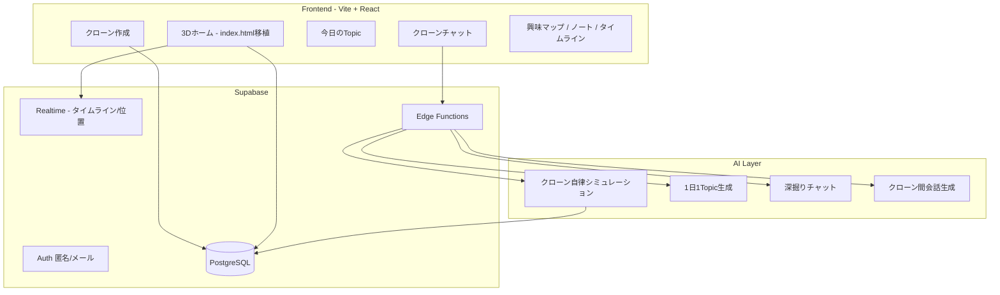
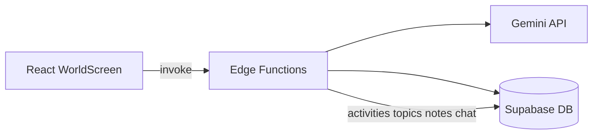

# 放置me — 実装プラン（Hackathon 2026/05）

> **プロダクト名**: 放置me  
> **コピー**: あなたのクローンが、知らない自分を見つけてくる。 / 放置しておくほど、あなたが広がる。  
> **モック（正）**: リポジトリ直下 [`index.html`](../index.html) — UI・3D・デザイントークンはここを唯一の参照源とする  
> **設計書**: 本ドキュメント冒頭のプロダクト設計（2026-05 版）

---

## 0. 現状と方針

| 項目 | 内容 |
|------|------|
| 旧プロダクト | Curio Meet（体験会フィード・予約）— 旧 `frontend/`（Vite + React）は 2026-05-25 に廃止 |
| 新プロダクト | 放置me — クローンAI × 3D「叡智の図書館」× 1日1Topic |
| モック | `index.html`（Three.js r128、単一HTML、Clone OS v2 UI） |
| 参照実装 | 旧 `houchi-me/`（Next.js 16 + R3F + Zustand + LocalStorage の MVP）を `frontend/` 本体に昇格し、`houchi-me/` は削除（2026-05-25） |
| 実装方針 | **houchi-me 系の Next.js 16 + R3F 構成を本線**として継続。データ・AI・認証は Supabase + Gemini + Edge Functions で抽象層を切って本番化 |

### 0.1 モックから移植するもの（チェックリスト）

- [x] CSS 変数（`--neon-cyan`, `--bg-0` 等）と glass UI → `frontend/src/styles/world.css`
- [x] グリッドレイアウト: `topbar / sidebar(280) / main / right(340) / command` → `WorldScreen.jsx`
- [x] 3D: 叡智の図書館（半透明書架・中央デスク・天窓・集会場相当の空間） → `initLibraryScene.js`
- [x] アバター: Mira / Sage / Echo パレット、吹き出し、名前タグ
- [x] ウェイポイント巡回 + HUD 連動（座標・速度・現地時刻・パンくず）
- [x] カメラ4種: 追従 / 軌道 / 俯瞰 / シネマ
- [x] ミニマップ（2D canvas）
- [x] 右パネル: いま / 今日のタイムライン / クローン統計（**データはダミー**）
- [x] 左サイド: クローンカード・バイタル・ワールド・ページツリー

### 0.3 現在地（Milestone B 完了 — 2026-05-25）

**houchi-me 系の Next.js 構成へ全面移行**完了。旧 Vite + React の `frontend/` と参照プロトタイプ `houchi-me/` を統合し、`frontend/`（Next.js 16 + R3F）一本に集約。`npm install && npm run dev` で `http://localhost:3000` が動く。`npm run build` も成功（Turbopack 静的書き出し: `/`, `/_not-found`, `/onboarding`）。

| 領域 | 状態 | 主なファイル |
|------|------|----------------|
| 3D + UI シェル | 完了（R3F 移植済み） | `frontend/src/components/world/WorldScene.tsx`, `Library.tsx`, `Avatar.tsx`, `CameraRig.tsx` |
| クローン操作 | **観察モードのみ** | 自動巡回。WASD / クリック移動は未（要再導入） |
| クローン作成 | **LocalStorage（抽象化済み）** | `frontend/src/app/onboarding/page.tsx`, `frontend/src/lib/storage.ts` |
| Topic / チャット | **モック LLM（抽象化済み）** | `frontend/src/lib/clone-engine.ts`（`LLMMockImpl`） |
| Supabase / AI | **一部接続済み（Gemini Edge Functions を実装）** | `frontend/NEXT_STEPS.md`、`backend/supabase/functions/`, `backend/supabase/migrations/20260525160000_create_houchi_me_schema.sql` |
| DB スキーマ | **houchi-me 用に置換済み** | `profiles` / `clones` / `topics` / `messages` / `feedback` + RLS + `handle_new_user` トリガ |
| **Gemini / エージェント LLM** | **Edge Functions 実装済み・未検証** | `frontend/src/lib/clone-engine.ts` の `SupabaseEdgeFunctionImpl` と `backend/supabase/functions/` |
| デプロイ | `vercel.json`（framework=nextjs）・Dockerfile/docker-compose 更新済み | `frontend/vercel.json`, `frontend/Dockerfile`, `frontend/docker-compose.yml` |
| CI / Preview | `cache-dependency-path: frontend/package-lock.json` のまま動作、env を `NEXT_PUBLIC_SUPABASE_*` に更新 | `.github/workflows/ci.yml`, `cd.yml` |

**まだ Must として未達のもの**: Supabase local / cloud 上での実動確認、毎日の質問 UI、興味マップ・ノート・タイムラインの専用画面と API 連携。**Milestone A 系で Vite に積んでいた WASD 操作・興味マップ画面・タイムライン画面は再移植が必要。**

### 0.4 ここから取り組むタスク（推奨順）

> 着手前は [rule.md](./rule.md) で **LINE 担当宣言** → ブランチ `feat/ho-xxx-...` → PR 時に §10 のチェックを更新。

#### スプリント 1 — データ基盤（最優先・並行可）

バックエンドがないと以降の Must がすべてダミーのままになる。**HO-101 → HO-102 → HO-104** を先に通す。

| 順 | ID | 担当 | やること | 完了の目安 |
|----|-----|------|----------|------------|
| 1 | **HO-101** | 阿部勝寿 | 放置me 用マイグレーション + RLS | `clones`, `clone_activities`, `daily_topics`, `notes` 等が作成される |
| 2 | **HO-102** | 阿部勝寿 | シード（叡智の図書館・4ロケーション・NPC Sage/Echo） | ローカル Supabase で参照データが入る |
| 3 | **HO-104** | 阿部勝寿 | オンボーディング → `clones` + `clone_profiles` を Supabase に保存 | LocalStorage から DB へ移行 |
| 4 | **HO-105** | 柴沼勇太 | 未作成クローン時はオンボーディングへ（現状ロジックの DB 版） | 新規ユーザーで DB に clone が無いと作成画面 |

#### スプリント 1.5 — Gemini API・クローンエージェント（LLM 基盤）**【ダミー置換の本体】**

DB（HO-101）と並行または直後に実施。**API キーは Supabase Edge Functions の Secret のみ**（`GEMINI_API_KEY`）。フロントにキーを置かない。

| 順 | ID | 担当 | やること | 完了の目安 |
|----|-----|------|----------|------------|
| 5 | **HO-110** | 阿部勝寿 | Gemini API 接続基盤（共通クライアント・モデル・エラーハンドリング） | `functions/_shared/gemini.ts` から 1 回呼べる |
| 6 | **HO-111** | 阿部勝寿 | クローンエージェント共通層（人格 system prompt・コンテキスト組み立て） | `clone_profiles` + 直近 activities を渡して応答が一貫 |
| 7 | **HO-112** | 王蕙鈺 | FE: `invokeCloneApi` ラッパー + **ダミーはフォールバックのみ** | `hochiDummy.js` を本番経路から外す |
| 8 | **HO-113** | 阿部勝寿 | **`clone-chat`**（Gemini・会話履歴・`chat_messages` 保存） | チャット送信 → クローン口調で返答（§HO-401） |
| 9 | **HO-114** | 阿部勝寿 | **`simulate-clone-day`**（エージェント風：1日分 activities → Topic → notes） | 「今日を要約」で DB に活動＋Topic が入る（§HO-301） |
| 10 | **HO-115** | 阿部勝寿 | **`encounter-dialogue`**（Sage/Echo 吹き出しを LLM 生成、任意で DB 保存） | 固定 `conversation[]` を LLM 会話に差し替え可 |
| 11 | **HO-116** | 阿部勝寿 | **`apply-daily-answers`**（回答を Gemini で解釈 → 同期率・vitals 更新） | 質問回答後に数値・探索バイアスが変わる（§HO-405） |
| 12 | **HO-117** | 王蕙鈺 | **ダミー UI 接続**：Topic オーバーレイ・チャット・「いま」文を API 結果表示 | `WorldScreen` / `TopicScreen` が `hochiDummy` 非依存 |

#### スプリント 2 — Must 機能の画面と API（FE + BE）

| 順 | ID | 担当 | やること | 完了の目安 |
|----|-----|------|----------|------------|
| 13 | **HO-301** | 柴沼勇太 | `simulate-clone-day` の FE トリガー（「今日を要約」）+ 結果表示 | **HO-114** 実装を呼ぶ |
| 14 | **HO-302** + **HO-303** | 柴沼勇太 / 王蕙鈺 | 今日の Topic 専用画面 + フィードバック | **HO-117** で LLM 生成 Topic を表示 |
| 15 | **HO-205** + **HO-206** | 柴沼勇太 / 王蕙鈺 | 右パネル「いま」「タイムライン」を DB 購読 | `clone_activities`（HO-114 出力） |
| 16 | **HO-401** + **HO-402** | 王蕙鈺 / 柴沼勇太 | クローンチャット画面 + クイック質問チップ | **HO-113**（Gemini）を呼ぶ |
| 17 | **HO-404** + **HO-405** | 王蕙鈺 / 阿部勝寿 | 毎日の質問 UI + 回答送信 | **HO-116** を呼ぶ |
| 18 | **HO-304** + **HO-305** + **HO-306** | 柴沼勇太 / 王蕙鈺 | 興味マップ・ノート（**HO-114** で生成した `notes` を表示） | ナレッジベースが DB 駆動 |
| 19 | **HO-501** | 柴沼勇太 / 王蕙鈺 | タイムライン画面（日別・過去遡り） | 活動履歴が LLM 生成分を含む |

#### スプリント 2.5 — 3D 操作感（ユーザーがクローンを動かす）

現状は `initLibraryScene.js` の**ウェイポイント自動巡回のみ**（観察専用）。プロダクト体験として **「放置で動くクローン」** と **「自分で図書館を歩く」** の両方を用意する。

| 順 | ID | 担当 | やること | 完了の目安 |
|----|-----|------|----------|------------|
| 19b | **HO-219** | 柴沼勇太 | **操作モード切替**（放置／手動）UI + 自動巡回の停止 | トグルでモードが切り替わる |
| 19c | **HO-220** | 柴沼勇太 | **キーボード操作**（WASD / 矢印）でクローン移動・歩行アニメ | 手動時に WASD で歩ける |
| — | **HO-221** | 柴沼勇太 | Should: **クリック移動**（床 Raycaster で目的地） | クリックした場所へ歩く |
| — | **HO-222** | 柴沼勇太 | Should: 手動中の **最寄りロケーション** を HUD に表示 | パンくずが「東の書架」等に追従 |
| — | **HO-223** | 柴沼勇太 | Could: モバイル用 **バーチャルスティック** | スマホでも移動可 |
| — | **HO-224** | 柴沼勇太 / 阿部勝寿 | 手動操作ログ → `clone_activities`（DB 後） | 歩いた軌跡をタイムラインに残す |

**体験の整理**

| モード | 操作 | プロダクト意味 |
|--------|------|----------------|
| **放置**（デフォルト） | 見るだけ。クローンが自律巡回 | 「放置している間に探索してくれる」 |
| **手動** | WASD 等で自分のクローンを操作 | 「図書館を覗き見しながら、自分でも歩いてみる」 |

#### スプリント 3 — 仕上げ・発表（Should / インフラ）

| 順 | ID | 担当 | やること | 備考 |
|----|-----|------|----------|------|
| 20 | **HO-103** | 柴沼勇太 | オンボーディングを設計書どおり項目拡充 | HO-104 後でも可 |
| 21 | **HO-403** + **HO-118** | 柴沼勇太 / 阿部勝寿 | コマンドバー → Gemini 指示パース or チャット | 「西の書架へ」デモ |
| 24 | **HO-502** ~ **HO-506** | 柴沼勇太 / 阿部勝寿 | フレンド・出会い・性格再設定 | Should |

#### スプリント 4 — デプロイ・インフラ（HO-601 系）

| 順 | ID | 担当 | やること | 完了の目安 |
|----|-----|------|----------|------------|
| 27 | **HO-601** | 菅家孝太郎 | Vercel Production URL 確定・README / 提出欄に記載 | 審査員が URL だけでデモ可能 |
| 28 | **HO-606** | 菅家孝太郎 | Vercel プロジェクト設定（Root=`frontend`、Next.js、本番ブランチ`main`） | ダッシュボードとリポ設定一致 |
| 29 | **HO-607** | 菅家孝太郎 | 環境変数（`NEXT_PUBLIC_SUPABASE_*`、必要なら Preview 用） | 本番ビルドが通る |
| 30 | **HO-608** | 菅家孝太郎 / 阿部勝寿 | Supabase Edge Secrets（`GEMINI_API_KEY` 等）とデプロイ手順 doc | BE 関数が本番で動く |
| 31 | **HO-609** | 菅家孝太郎 / 中村悠紀 | `main` push 後の Production 動作確認チェックリスト | 3D・オンボ・LLM の smoke |
| 32 | **HO-610** | 菅家孝太郎 | PR Preview 運用（`cd.yml`）の URL を PR に貼るルール化 | レビュー時に確認 |

#### スプリント 4 — デザイン・UI 整理（HO-701 系）

| 順 | ID | 担当 | やること | 完了の目安 |
|----|-----|------|----------|------------|
| 33 | **HO-701** | 中村悠紀 / 柴沼勇太 | デザイン基準 doc（`index.html` との差分チェックリスト） | `project-docs/design-guide.md` |
| 34 | **HO-702** | 柴沼勇太 | `WorldScreen` コンポーネント分割（§HO-003） | `components/world/*` |
| 35 | **HO-703** | 柴沼勇太 | オンボーディング・モーダルのビジュアル統一（glass / neon） | ワールド画面とトーン一致 |
| 36 | **HO-704** | 柴沼勇太 / 王蕙鈺 | Topic / Chat / 設定系オーバーレイの UI 統一 | 同じパネル・ボタン・タイポ |
| 37 | **HO-705** | 柴沼勇太 | レイアウト整理（パネル幅・重なり・操作パネル位置） | 右操作パネルとカメラ HUD の干渉解消 |
| 38 | **HO-706** | 王蕙鈺 | ローディング / エラー / 空状態（LLM・API 待ち） | スピナー・再試行・フォールバック表示 |
| 39 | **HO-707** | 柴沼勇太 | 旧 Curio Meet 画面・未使用 CSS の整理 | ビルド対象から外す or 削除 |
| 40 | **HO-708** | 中村悠紀 / 柴沼勇太 | タイポ・コピー統一（放置me、サブコピー、ボタン文言） | README・UI 文言一致 |
| 41 | **HO-709** | 柴沼勇太 | Should: 狭い画面・タブレットの最低限対応 | 横スクロール or パネル折りたたみ |
| 42 | **HO-710** | 柴沼勇太 | Should: アクセシビリティ（フォーカス、aria、キーボード操作ヒント） | 手動操作と整合 |

#### スプリント 4 — 提出物（全員）

| 順 | ID | 担当 | やること | 備考 |
|----|-----|------|----------|------|
| 43 | **HO-602** | 中村悠紀 | 発表用シナリオ doc（3分） | PM |
| 44 | **HO-603** | 全員（編集: 柴沼勇太） | スクリーンショット 2枚 → `docs/` | 提出用 |
| 45 | **HO-604** | 柴沼勇太 | Could: バッジ・ランキング UI | FE |
| 46 | **HO-605** | 柴沼勇太 | Could: 複数ワールド切替 UI | FE |

#### いま担当を取りやすいタスク（単独で切り出し可能）

| ID | 担当 | 一人で完結しやすい | ブロッカー |
|----|------|-------------------|-----------|
| HO-101 | 阿部勝寿 | ◎ | なし |
| HO-102 | 阿部勝寿 | ◎（HO-101 後） | HO-101 |
| HO-110 | 阿部勝寿 | ◎ | API Secret |
| HO-111 | 阿部勝寿 | ◎（HO-110 後） | HO-110 |
| HO-113 | 阿部勝寿 | ○ | HO-110, HO-111 |
| HO-114 | 阿部勝寿 | ○ | HO-101, HO-111 |
| HO-219 | 柴沼勇太 | ◎ | なし |
| HO-220 | 柴沼勇太 | ◎ | なし |
| HO-302 | 柴沼勇太 | ○ | HO-117 推奨 |
| HO-304 | 柴沼勇太 | ○ | なし |
| HO-501 | 柴沼勇太 | ○ | なし |
| HO-601 | 菅家孝太郎 | ◎ | `main` push 権限 |
| HO-602 | 中村悠紀 | ◎ | なし |

#### 意図的に後回し（Milestone A で十分なもの）

- **HO-006**（`@react-three/fiber`）— 現状の vanilla Three で問題なし
- **HO-005**（Bloom）— オプション。パフォーマンス優先ならスキップ可
- **HO-208**, **HO-202**, **HO-203** — 3D 上は **実装済み**（追加作業は DB 連携のみ）
- 旧 Curio 画面削除 — ビルドに影響しないため **HO-501 以降**でまとめて削除可

### 0.2 MVP 優先度（設計書 §19 対応）

| 優先 | 機能 |
|------|------|
| **Must** | クローン作成、3Dワールドビュー、今日のTopic、理由説明、クローンチャット、毎日の質問、興味マップ、ノート、タイムライン |
| **Should** | 他クローン吹き出し、フレンド、ユーザー間会話、性格変更、ロケーション選好、カメラ切替、ミニマップ、**クローン手動操作（放置／操作モード）** |
| **Could** | 音声入力、ランキング、共有カード、リアルタイム会話、複数ワールド、外見カスタム、SNS連携 |

---

## 1. アーキテクチャ



### 1.1 技術スタック（2026-05-25 確定 — houchi-me 構成）

| 層 | 選定 | 備考 |
|----|------|------|
| フロント | **Next.js 16 (App Router) + React 19 + TypeScript** | `frontend/`。Turbopack ビルド。`src/app/` ルーティング |
| 3D | **Three.js + @react-three/fiber + @react-three/drei + @react-three/postprocessing** | 旧 Vite の vanilla Three 実装は撤去、R3F に統一 |
| 状態管理 / UI | **Zustand**、Tailwind CSS v4（`@theme inline` でカラー/フォントトークン） | `frontend/src/lib/store.ts`、`src/app/globals.css` |
| 永続化 | `Storage` インターフェース（`LocalStorageImpl` 既定 / `SupabaseImpl` 差し替え） | `frontend/src/lib/storage.ts` — 末尾 1 行で切替 |
| LLM | `CloneEngine` インターフェース（`LLMMockImpl` 既定 / `SupabaseEdgeFunctionImpl` 差し替え） | `frontend/src/lib/clone-engine.ts` — Supabase 設定時に Edge Functions 経由へ切替 |
| バック | Supabase（Auth / DB / Realtime / Edge Functions） | 旧 Curio スキーマは削除、`profiles/clones/topics/messages/feedback` に置換済み |
| AI | **Google Gemini API**（`models/gemini-2.5-flash` 既定）— Supabase Edge Functions 経由でキーを秘匿 | `GEMINI_API_KEY` は Supabase Edge Functions Secret のみ。frontend には置かない |
| インフラ | Vercel（root=`frontend`、Next.js auto-detect）+ Supabase Cloud + 任意 Docker | `frontend/Dockerfile`（multi-stage: dev / build / production の next start） |

### 1.2 画面ルーティング（MVP）

| パス / 画面 ID | 画面 | モック対応 |
|----------------|------|------------|
| `/onboarding` | クローン作成 | — |
| `/` または `/world` | ホーム＝仮想世界ビュー | `index.html` 全体 |
| `/topic/today` | 今日のTopic | 設計書 §14 |
| `/chat` | クローンチャット | コマンドバー + 専用画面 |
| `/map` | 興味マップ | 旧 curiosity_map の置換 |
| `/notes`, `/notes/:id` | ナレッジベース | 左「ページ」ツリー |
| `/timeline` | 履歴（右パネル拡張） | `#timeline` |
| `/friends` | フレンド・出会い | Should |

---

## 2. データモデル（Supabase）

旧スキーマ（`experiences`, `reservations`, `curiosity_map_items` 等）は **2026-05-25 にマイグレーションごと削除**。`backend/supabase/migrations/20260525160000_create_houchi_me_schema.sql` で新スキーマを置いた。

### 2.0 実装済み（MVP コア）

| テーブル | 用途 | 主要カラム |
|----------|------|------------|
| `profiles` | `auth.users` 1:1 のユーザープロフィール | `id` (FK auth.users), `email`, `display_name` |
| `clones` | 1ユーザー1クローン | `user_id`, `name`, `mbti`, `likes[]`, `dislikes[]`, `self_description`, `ideal_self`, `personality_shift`, `exploration_type`, `sync_rate` |
| `topics` | 1日1Topic | `clone_id`, `date_key` (`(clone_id, date_key)` ユニーク), `title`, `reasoning`, `exploration_path[]`, `related_concepts[]` |
| `messages` | クローンチャット | `clone_id`, `role` (`user`/`clone`), `text` |
| `feedback` | Topic フィードバック | `topic_id` (PK), `kind` (`interested`/`different`/`more`) |

RLS は全テーブルで有効、`auth.uid()` 本人のみ。`auth.users` INSERT で `public.handle_new_user` トリガが `profiles` を自動作成。

### 2.1 将来拡張テーブル（未実装・要 HO-101 拡張）

| テーブル | 用途 | 主要カラム |
|----------|------|------------|
| `users` | 人間ユーザー | 既存流用 + `display_name` |
| `clones` | 1ユーザー1クローン（MVP） | `user_id`, `name`, `mbti`, `archetype`, `sync_rate`, `vitals` jsonb, `appearance` jsonb |
| `clone_profiles` | 初回入力・性格オフセット | `likes`, `recent_interests`, `bio`, `ideal_self`, `personality_shift`, `dislikes` |
| `worlds` | 叡智の図書館 等 | `slug`, `name`, `is_default` |
| `locations` | 中央デスク / 東の書架 等 | `world_id`, `slug`, `name`, `position` jsonb |
| `clone_activities` | タイムライン1行 | `clone_id`, `location_id`, `activity_type`, `summary`, `metadata` jsonb, `occurred_at` |
| `daily_topics` | 1日1Topic | `clone_id`, `topic_date`, `title`, `reason`, `source_activity_ids` uuid[] |
| `notes` | クローン執筆ノート | `clone_id`, `parent_id`, `title`, `body`, `tags` |
| `note_links` | バックリンク | `from_note_id`, `to_note_id` |
| `interest_map_nodes` | 興味マップ | `clone_id`, `label`, `kind`, `depth`, `source` |
| `clone_encounters` | 他クローンとの出会い | `clone_a_id`, `clone_b_id`, `location_id`, `dialogue` jsonb, `cross_topic` |
| `friendships` | フレンド | `user_a_id`, `user_b_id`, `status` |
| `chat_messages` | ユーザー↔クローン | `clone_id`, `role`, `content`, `channel` |
| `daily_questions` | マスタ質問 | `question_key`, `text`, `sort_order` |
| `daily_question_answers` | 回答 | `clone_id`, `question_id`, `answer`, `answered_at` |

### 2.2 RLS 方針

- 自分の `clone` / `notes` / `activities` / `chat` のみ CRUD
- `clone_encounters`: 当事者クローンのオーナーのみ read
- デモ用: シードに Sage / Echo 相当の **NPC クローン** を2体投入（モックの会話再現）

### 2.3 Realtime（Should）

- チャンネル `clone:{id}` — 最新 `clone_activities` 1件、`vitals`、現在 `location_id`
- フロントの「いま」カード・ミニマップ・HUD を購読で更新

---

## 3. AI / バックエンドジョブ（Gemini・エージェント）

### 3.1 方針（2026-05-25 改訂）

- **プロバイダ**: **Google Gemini API**（`models/gemini-2.5-flash` 既定）。
- **実行場所**: Supabase **Edge Functions**（Deno）を本線。frontend からは `supabase.functions.invoke()` で呼ぶ。
- **抽象境界**: フロントは `frontend/src/lib/clone-engine.ts` の `CloneEngine` インターフェース経由でのみ LLM を叩く。`LLMMockImpl`（既定）→ `SupabaseEdgeFunctionImpl`（本番）の切替。
- **エージェント像**: 単発 completion ではなく、**クローン人格（system）+ 記憶コンテキスト（user/data）+ タスク別指示** で「放置中に探索しているクローン」として振る舞う
- **モック**: `frontend/src/lib/clone-engine.ts` 内の `MOCK_TOPIC_SEEDS` / `LLMMockImpl` がそのままフォールバック。`hochiDummy.js` は廃止。
- **Secret 方針**: `GEMINI_API_KEY` は Supabase Edge Functions Secret のみ。frontend / Vercel の公開環境変数には置かない。



### 3.2 エージェント別ジョブ（Edge Function）

| 関数 | タスク ID | 担当 | トリガー | 出力 |
|------|-----------|------|----------|------|
| `clone-chat` | HO-113 / HO-401 | 阿部勝寿 / 王蕙鈺 | ユーザー送信・クイック質問 | 返答テキスト + DB 保存 |
| `simulate-clone-day` | HO-114 / HO-301 | 阿部勝寿 / 柴沼勇太 | 「今日を要約」・デモボタン | `clone_activities` 複数、`topics` 1、`notes` 1 以上 |
| `encounter-dialogue` | HO-115 / HO-208 | 阿部勝寿 / 柴沼勇太 | 集会場・NPC 近接 | `clone_encounters.dialogue` + `cross_topic` |
| `apply-daily-answers` | HO-116 / HO-405 | 阿部勝寿 / 王蕙鈺 | 毎日の質問送信 | `clones` 更新 |
| `parse-clone-command` | HO-118 / HO-403 | 阿部勝寿 / 柴沼勇太 | コマンドバー送信 | フロントへ JSON |

### 3.3 共通実装（`HO-110` / `HO-111`）

| モジュール | パス（案） | 内容 |
|------------|------------|------|
| Gemini クライアント | `backend/supabase/functions/_shared/gemini.ts` | `fetch` で Generative Language API、`generateContent` / ストリーム（可能なら） |
| コンテキスト | `_shared/cloneContext.ts` | `clone` + `clone_profiles` + 直近 `activities` / `daily_topics` / `interest_map_nodes` をプロンプト用 JSON に整形 |
| 人格プロンプト | `_shared/prompts/clonePersona.ts` | MBTI・好きなもの・性格シフト・「なりたい自分」を反映した system 文 |
| JSON 出力 | 各 EF 内 | Topic 生成などは `responseMimeType: application/json` で構造化（Gemini の JSON モード） |

**プロンプト設計の要点**

- 入力: `clone_profiles` + 直近7日 `clone_activities` + 既存 `interest_map_nodes`
- 性格シフト（反転型等）: ロケーション重み・行動タイプを system に明示（設計書 §9）
- Topic 理由: **行動経路を必ず含める**（設計書 §14 の例文構造）。`simulate-clone-day` の最終ステップで検証
- コスト抑制: デモは 1 日 1 回の `simulate-clone-day` + チャット数回に抑える（`AI_USAGE_LOG` にトークン記録）

### 3.4 ダミー表示 → LLM 置き換えマップ（`HO-117`）

| 現状 | 置き換え後 | 担当 |
|------|------------|------|
| Topic モック固定文 | `daily_topics`（HO-114） | 王蕙鈺 / 柴沼勇太 |
| チャットモック | `clone-chat`（HO-113） | 王蕙鈺 / 柴沼勇太 |
| 右パネル「いま」モック | 最新 `clone_activity` | 王蕙鈺 / 柴沼勇太 |
| タイムラインモック | 当日 `clone_activities` | 王蕙鈺 / 柴沼勇太 |
| 3D 吹き出し固定 | `encounter-dialogue`（HO-115） | 阿部勝寿 / 柴沼勇太 |
| コマンドバー未接続 | `parse-clone-command` 等 | 柴沼勇太 / 阿部勝寿 |

---

## 4. フェーズとスケジュール（3日間想定）

| Day | ゴール | デモで見せるもの |
|-----|--------|------------------|
| **Day 1** | モック移植 + クローン作成 + DB 新規 | `index.html` 相当の 3D が React で動く。オンボーディング完了で Mira 表示 |
| **Day 2** | Must のデータ連携 + Topic + チャット + タイムライン | 今日のTopic・理由・関連ノートが DB/AI から出る。質問1セット回答で同期率変化 |
| **Day 3** | Should 一部 + 仕上げ + デプロイ | 他クローン吹き出し、フレンド一覧、発表用シナリオ通し |

---

## 5. タスク一覧

タスク ID は **`HO-xxx`**（放置me）。着手前に [rule.md](./rule.md) の担当宣言・ブランチ命名に従う。

凡例: `[Must]` / `[Should]` / `[Could]` — 設計書 §19

### 担当メンバー（表の「担当」列）

| 氏名 | 役割 | 主な領域 |
|------|------|----------|
| 中村悠紀 | PM | 進行・提出・コピー・デザイン承認 |
| 菅家孝太郎 | Infra | Vercel / CI / 環境変数 / 本番確認 |
| 柴沼勇太 | FE | 3D・画面 UI・デザイン反映 |
| 王蕙鈺 | Full | API 接続・ダミー除去・エラー UI |
| 阿部勝寿 | BE | Supabase / Edge Functions / LLM |

`A / B` は **主担当 A・支援 B**。詳細は [README](../README.md) の担当割り振り表。

### Phase A — 基盤・モック移植（Day 1 AM）

| ID | 優先 | タスク | 成果物 | 担当 |
|----|------|--------|--------|------|
| HO-001 | — | README / チーム情報を放置me に更新 | `README.md` | 中村悠紀 |
| HO-002 | — | デザイントークンを Tailwind + CSS 変数化 | `globals.css`, `@theme` | 柴沼勇太 |
| HO-003 | Must | `index.html` のレイアウトを React シェルに移植（3D除く） | `AppShell`, 各パネル | 柴沼勇太 |
| HO-004 | Must | Three.js シーンを R3F に移植 | `world/*`, `VirtualWorld` | 柴沼勇太 |
| HO-005 | Must | ローダー・ブートシーケンス（モック同等） | `Loader.tsx` | 柴沼勇太 |
| HO-006 | — | `three`, `@react-three/fiber`, `@react-three/drei` 依存追加 | `package.json` | 柴沼勇太 / 菅家孝太郎 |

### Phase AI — Gemini API・クローンエージェント（LLM）**【ダミー→本番応答】**

| ID | 優先 | タスク | 成果物 | 担当 |
|----|------|--------|--------|------|
| HO-110 | Must | LLM API 基盤（Secret、共通クライアント） | `functions/_shared/` 等 | 阿部勝寿 |
| HO-111 | Must | クローンエージェント共通層（persona + `buildCloneContext`） | `_shared/cloneContext.ts` 等 | 阿部勝寿 |
| HO-112 | Must | FE API ラッパー・ダミーはフォールバックのみ | `clone-engine.ts` 接続 | 王蕙鈺 |
| HO-113 | Must | `clone-chat`（LLM・`chat_messages`） | `functions/clone-chat/` | 阿部勝寿 |
| HO-114 | Must | `simulate-clone-day`（1日シミュレーション → Topic/notes/activities） | `functions/simulate-clone-day/` | 阿部勝寿 |
| HO-115 | Should | `encounter-dialogue`（吹き出し会話・交差 Topic） | `functions/encounter-dialogue/` | 阿部勝寿 |
| HO-116 | Must | `apply-daily-answers`（回答解釈 → 同期率等） | `functions/apply-daily-answers/` | 阿部勝寿 |
| HO-117 | Must | Topic/チャット/いま/タイムラインの **ダミー除去**・API 結果を UI にバインド | 各 View / store | 王蕙鈺 |
| HO-118 | Should | `parse-clone-command`（自然言語指示） | `functions/parse-clone-command/` | 阿部勝寿 |

### Phase B — クローン作成・DB（Day 1 PM）

| ID | 優先 | タスク | 成果物 | 担当 |
|----|------|--------|--------|------|
| HO-101 | Must | 新スキーママイグレーション + RLS | `migrations/*_hochi_me_schema.sql` | 阿部勝寿 |
| HO-102 | Must | シード: 叡智の図書館、4ロケーション、NPC Sage/Echo | `seed.sql` | 阿部勝寿 |
| HO-103 | Must | クローン作成画面（設計書 §7, §8） | `onboarding/page.tsx` | 柴沼勇太 |
| HO-104 | Must | 作成 API: `clones` + `clone_profiles` insert | Supabase / `storage.ts` | 阿部勝寿 |
| HO-105 | Must | 未作成時は `/onboarding` へリダイレクト | `app/page.tsx` | 柴沼勇太 |

### Phase C — 3D ホーム・ライブ UI（Day 1–2）

| ID | 優先 | タスク | 成果物 | 担当 |
|----|------|--------|--------|------|
| HO-201 | Must | 自分のクローンのみ巡回（ウェイポイント → HUD 連動） | R3F 巡回・HUD | 柴沼勇太 |
| HO-202 | Should | カメラ4モード切替 | `CameraButtons` 等 | 柴沼勇太 |
| HO-203 | Should | ミニマップ（全クローン位置・発話者パルス） | `MiniMap.tsx` | 柴沼勇太 |
| HO-204 | Must | 左: クローンカード・バイタル・同期率表示 | DB `clones.vitals`, `sync_rate` | 柴沼勇太 |
| HO-205 | Must | 右: 「いま」— 現在 activity を表示 | `NowCard` + DB | 柴沼勇太 / 王蕙鈺 |
| HO-206 | Must | 右: 今日のタイムライン一覧 | `Timeline` + DB | 柴沼勇太 / 王蕙鈺 |
| HO-207 | Must | 下部コマンドバー UI（送信は Phase E で接続） | `CommandBar.tsx` | 柴沼勇太 |
| HO-208 | Should | 他クローン吹き出し（固定 → **HO-115** LLM 会話へ差し替え可） | 3D 吹き出し | 柴沼勇太 / 阿部勝寿 |

### Phase C2 — クローン操作感（ユーザー操作）

| ID | 優先 | タスク | 成果物 | 担当 |
|----|------|--------|--------|------|
| HO-219 | Should | 放置／手動モード切替 + 自動巡回の一時停止 | R3F トグル | 柴沼勇太 |
| HO-220 | Should | WASD・矢印でクローン移動（歩行アニメ・速度 HUD） | `useFrame` 移動 | 柴沼勇太 |
| HO-221 | Should | 床クリックで目的地移動（Raycaster） | クリックツール | 柴沼勇太 |
| HO-222 | Should | 手動時に最寄りロケーション名を HUD 更新 | `Breadcrumb` 連動 | 柴沼勇太 |
| HO-223 | Could | モバイル・バーチャルスティック | タッチ UI | 柴沼勇太 |
| HO-224 | Could | 手動移動を `clone_activities` に記録 | HO-101 後 | 柴沼勇太 / 阿部勝寿 |

### Phase D — 今日のTopic・興味マップ・ノート（Day 2）

| ID | 優先 | タスク | 成果物 | 担当 |
|----|------|--------|--------|------|
| HO-301 | Must | 「今日を要約」等の FE トリガー → **HO-114** を呼ぶ | ボタン + ローディング UI | 柴沼勇太 |
| HO-302 | Must | 今日のTopic画面（タイトル・理由・関連ノート3） | `TodayTopicView` 等 | 柴沼勇太 / 王蕙鈺 |
| HO-303 | Must | フィードバック UI: 気になる / 違う / もっと知りたい | `daily_topics` 等 | 柴沼勇太 |
| HO-304 | Must | 興味マップ画面（種別・深さ・未解放） | `app/map/page.tsx` | 柴沼勇太 |
| HO-305 | Must | ノート一覧 + 詳細（Notion風簡易 Markdown） | `app/notes/page.tsx` | 柴沼勇太 |
| HO-306 | Must | ページツリー ↔ `notes.parent_id` | `NavTree` 連動 | 柴沼勇太 |
| HO-307 | Should | ナレッジベース / AIメモリーボールト / 目標の区分 | `notes.kind` 列追加 | 阿部勝寿 |

### Phase E — チャット・毎日の質問・同期率（Day 2–3）

| ID | 優先 | タスク | 成果物 | 担当 |
|----|------|--------|--------|------|
| HO-401 | Must | クローンチャット FE 完成 → **HO-113** 接続 | `ChatView` + invoke | 王蕙鈺 |
| HO-402 | Must | クローンチャット画面 + クイック質問チップ | `ChatView.tsx` | 柴沼勇太 |
| HO-403 | Must | コマンドバー → チャット or 指示パース（「西の書架へ」） | `CommandBar` | 柴沼勇太 / 阿部勝寿 |
| HO-404 | Must | 毎日の質問マスタ + 回答 UI（5–6問） | 質問 UI | 王蕙鈺 |
| HO-405 | Must | 毎日の質問 FE → **HO-116** 接続 | 同期率表示が変化 | 王蕙鈺 / 阿部勝寿 |
| HO-406 | Could | 音声入力（Web Speech API） | チャット画面 | 柴沼勇太 |

### Phase F — タイムライン・フレンド・ユーザー会話（Day 3）

| ID | 優先 | タスク | 成果物 | 担当 |
|----|------|--------|--------|------|
| HO-501 | Must | タイムライン画面（日別・過去遡り） | `app/timeline/page.tsx` | 柴沼勇太 / 王蕙鈺 |
| HO-502 | Should | 出会ったクローン一覧 + 共通Topic | `app/friends/page.tsx` | 柴沼勇太 |
| HO-503 | Should | 「この人と話してみますか？」→ ユーザー間チャット | `user_chats` テーブル検討 | 阿部勝寿 / 柴沼勇太 |
| HO-504 | Should | フレンド追加・招待 | `friendships` | 阿部勝寿 |
| HO-505 | Should | 性格シフト再設定 | オンボ編集モード | 柴沼勇太 |
| HO-506 | Should | 行動タイプ（深掘り/拡散/社交/反転）→ ロケーション重み | `clone_profiles.exploration_mode` | 阿部勝寿 |

### Phase G — デプロイ・インフラ・提出

| ID | 優先 | タスク | 成果物 | 担当 |
|----|------|--------|--------|------|
| HO-601 | Must | Production デモ URL 確定・README 記載 | デモ環境欄 | 菅家孝太郎 |
| HO-606 | Must | Vercel プロジェクト設定（root=`frontend`） | ダッシュボード | 菅家孝太郎 |
| HO-607 | Must | 本番環境変数 `NEXT_PUBLIC_SUPABASE_*` | Vercel Env | 菅家孝太郎 |
| HO-608 | Must | Edge Function Secrets 手順 + API キー | `project-docs/deploy.md` 等 | 菅家孝太郎 / 阿部勝寿 |
| HO-609 | Must | 本番 smoke テスト（3D・オンボ・主要導線） | チェックリスト | 菅家孝太郎 / 中村悠紀 |
| HO-610 | Should | PR Preview URL の共有ルール | `rule.md` 追記 | 菅家孝太郎 |
| HO-602 | Must | 発表用シナリオ（3分） | `demo-script.md` | 中村悠紀 |
| HO-603 | Must | スクリーンショット 2枚 | `docs/screenshot-*.png` | 全員（編集: 柴沼勇太） |
| HO-604 | Could | バッジ・ランキング UI | ゲーミフィケーション §18 | 柴沼勇太 |
| HO-605 | Could | 複数ワールド切替 UI | 左ナビ | 柴沼勇太 |

### Phase H — デザイン・UI 整理

| ID | 優先 | タスク | 成果物 | 担当 |
|----|------|--------|--------|------|
| HO-701 | Must | デザイン基準（モック準拠チェックリスト） | `design-guide.md` | 中村悠紀 / 柴沼勇太 |
| HO-702 | Should | AppShell / パネルコンポーネント分割 | `components/*` | 柴沼勇太 |
| HO-703 | Must | オンボーディング UI polish | `onboarding/page.tsx` | 柴沼勇太 |
| HO-704 | Must | Topic / Chat / Notes ビュー UI 統一 | 各 View | 柴沼勇太 / 王蕙鈺 |
| HO-705 | Must | 3D ホーム HUD レイアウト整理（操作パネル・重なり） | `globals.css` 等 | 柴沼勇太 |
| HO-706 | Must | LLM 待ち・エラー・再試行 UI | 共通コンポーネント | 王蕙鈺 |
| HO-707 | Should | 旧コード・未使用 asset 削除 | 未使用ファイル | 柴沼勇太 |
| HO-708 | Must | 文言・コピー統一（放置me） | 全画面 | 中村悠紀 / 柴沼勇太 |
| HO-709 | Could | レスポンシブ最低限 | 768px 未満 | 柴沼勇太 |
| HO-710 | Could | a11y（aria、フォーカス、操作ヒント） | キーボード操作と整合 | 柴沼勇太 |

---

## 6. フロントコンポーネント構成（2026-05-25 現状 — houchi-me 構成）

```
frontend/
├── next.config.ts / tsconfig.json / eslint.config.mjs / postcss.config.mjs
├── Dockerfile / docker-compose.yml / vercel.json / .env.example
├── public/                       # static SVGs
└── src/
    ├── app/
    │   ├── layout.tsx            # ルートレイアウト（fonts / metadata）
    │   ├── globals.css           # Tailwind v4 + neon カラー + アニメーション
    │   ├── page.tsx              # トップ。Loader → AppShell（未作成時 /onboarding へ）
    │   └── onboarding/page.tsx   # 6ステップのクローン作成
    ├── components/
    │   ├── Loader.tsx            # CLONE OS ブートシーケンス
    │   ├── layout/               # AppShell / TopBar / Sidebar / RightPanel / CommandBar
    │   ├── sidebar/              # CloneStatusCard / Vitals / NavTree / MiniMap
    │   ├── panel/                # NowCard / Timeline / Stats
    │   ├── main/                 # Breadcrumb / ViewTabs / HudCoord / CameraButtons / ActivityBadge / WorldStats
    │   ├── topic/TodayTopicView.tsx
    │   ├── chat/ChatView.tsx
    │   └── world/                # VirtualWorld / WorldScene / Library / Avatar / Particles / CameraRig / palettes
    ├── lib/
    │   ├── storage.ts            # Storage インタフェース + LocalStorageImpl（末尾 1 行で SupabaseImpl に差替）
    │   ├── clone-engine.ts       # CloneEngine インタフェース + LLMMockImpl（Supabase 設定時は Edge Functions 経由）
    │   ├── store.ts              # Zustand のグローバル状態
    │   └── util.ts
    └── types/index.ts            # Clone / Topic / Message / Feedback / CameraMode / WorldAvatarState
```

**未移植（旧 Vite に存在し、Next.js 側にまだ無いもの）**

- 興味マップ画面 (`InterestMapScreen.jsx` 相当) → HO-304 で `src/app/map/page.tsx` を新設
- ノート画面 (`NotesScreen.jsx` 相当) → HO-305 で `src/app/notes/page.tsx` を新設
- タイムライン画面 (`TimelineScreen.jsx` 相当) → HO-501 で `src/app/timeline/page.tsx` を新設
- WASD 操作・クリック移動 → HO-219〜222 を R3F の `useFrame` ベースで再実装

---

## 7. デザイン仕様（モック準拠）

| トークン | 値 | 用途 |
|----------|-----|------|
| `--bg-0` | `#03040f` | 背景 |
| `--neon-cyan` | `#4ff5e7` | Mira アクセント |
| `--neon-violet` | `#a378ff` | ブランド |
| `--neon-pink` | `#ff6ec7` | Sage |
| `--neon-green` | `#74ffa8` | Echo |
| フォント | Inter + Noto Sans JP + JetBrains Mono | HUD・時刻 |

**アバター（Mira デフォルト）**: 紫×シアン、フード型、胸コア発光 — `PALETTES.mira` in `index.html`

**ロケーション slug（MVP）**

| slug | 表示名 | モック上のウェイポイント |
|------|--------|-------------------------|
| `central-desk` | 中央デスク | wp index 0, 5 |
| `east-shelf` | 東の書架 | wp index 1 |
| `skylight` | 天窓 / 観測所 | wp index 2 |
| `west-shelf` | 西の書架 | wp index 3 |
| `assembly` | 集会場 | 会話シーン（NPC 配置） |

---

## 8. 発表デモシナリオ（3分・推奨）

1. **オンボーディング** — ミサキ想定で Mira 作成、「少し外向的」選択  
2. **ホーム** — 3D で Mira が書架→デスクを巡回。Sage と吹き出し交差  
3. **今日のTopic** — 「カフェ巡り × フィルムカメラ」+ 理由（行動経路つき）  
4. **チャット** — 「なぜ興味を持ったの？」→ クローンが自分との関係を説明  
5. **毎日の質問** — 2問回答 → 同期率 99.6% → 99.8% など視覚的変化  
6. **タイムライン** — 「放置していた間にこう動いていた」一覧  
7. **クロージング** — コピー「あなたのクローンが、知らない自分を見つけてくる。」

---

## 9. リスクとカットライン

| リスク | 対策 | カット時 |
|--------|------|----------|
| Three.js 移植が重い | Day1 は `index.html` を iframe 埋め込みでも可 | 後から React 統合 |
| AI コスト / 遅延 | デモは `simulate-clone-day` 1回/日 + チャット数回に抑制 | ストリーミングは HO-113 で任意 |
| Gemini 未設定 | `HO-112` で `hochiDummy` フォールバック表示 | Secret 必須で本番 |
| リアルタイム複雑 | ポーリング 5s で代替 | Realtime |
| 旧 Curio コード混在 | `frontend/src/screens/*` を段階削除 | ビルド通過優先 |
| ユーザー間マッチング | フレンドはデモ2アカウント固定 | HO-503 |

**Day3 最低ライン（Must のみ）**: HO-101,104,110–114,117,201,204–206,301–306,401–405,501 + 3D（HO-004 任意）。**LLM なしデモは不可**（最低 HO-113 チャット + HO-114 Topic 生成）。

---

## 10. 進捗チェック（手動更新）

> **次に着手するタスクの一覧は §0.4 を参照。**

### Phase A — Milestone A→B（houchi-me Next.js へ統合済み）
- [x] HO-001（README・プロダクト名）
- [x] HO-002（Tailwind v4 `@theme inline` + neon カラー、`src/app/globals.css`）
- [x] HO-003（`components/layout/*` で TopBar / Sidebar / RightPanel / CommandBar 分割済み）
- [x] HO-004（R3F: `components/world/WorldScene.tsx`, `Library.tsx`, `Avatar.tsx`, `CameraRig.tsx`, `Particles.tsx`）
- [x] HO-005（R3F 化に伴い Bloom は `@react-three/postprocessing` で任意）
- [x] HO-006（`@react-three/fiber` `@react-three/drei` `@react-three/postprocessing` 導入済み、`three@^0.184`）

### Phase B — データ基盤（スキーマ完了 / 接続は次）
- [x] HO-101（スキーマ + RLS：`backend/supabase/migrations/20260525160000_create_houchi_me_schema.sql`）
- [x] HO-102（最小シード：`backend/supabase/seed.sql` の Mira / Topic / Messages）
- [x] HO-103（6 ステップオンボーディング：`src/app/onboarding/page.tsx`）
- [ ] HO-104（`SupabaseImpl` 実装は未 — `frontend/src/lib/storage.ts` 末尾 1 行差し替え + メソッド本体）
- [x] HO-105（未作成時に `/onboarding` 遷移：`src/app/page.tsx`）

### Phase AI — **← Gemini + Supabase Edge Functions**
- [x] HO-110（共通 Gemini クライアント: `backend/supabase/functions/_shared/gemini.ts`）
- [x] HO-111（人格 system プロンプト + コンテキスト組み立て: `backend/supabase/functions/_shared/clone-context.ts`）
- [ ] HO-112（FE 抽象は実装済み。UI からの本番経路確認が残り）
- [x] HO-113（`backend/supabase/functions/clone-chat/`）
- [x] HO-114（`backend/supabase/functions/simulate-clone-day/`）
- [ ] HO-115（Edge / API Route で `encounter-dialogue`）
- [ ] HO-116（`apply-daily-answers`）
- [ ] HO-117（モック UI → Gemini 結果に差替。UI 側の確認と空状態調整）
- [ ] HO-118（`parse-clone-command`）

### Phase C
- [x] HO-201（自動巡回 + HUD 連動：`WorldScene.tsx` / `HudCoord.tsx`）
- [x] HO-202（4カメラ：`CameraButtons.tsx` / `CameraRig.tsx`）
- [x] HO-203（ミニマップ：`sidebar/MiniMap.tsx`）
- [x] HO-204（クローンカード・バイタル：`sidebar/CloneStatusCard.tsx` / `Vitals.tsx`、DB 未連携）
- [ ] HO-205（NowCard モック表示中：`panel/NowCard.tsx`。DB 化は HO-114 後）
- [ ] HO-206（Timeline モック表示中：`panel/Timeline.tsx`。DB 化は HO-114 後）
- [x] HO-207（CommandBar UI：`layout/CommandBar.tsx`。送信先 LLM は HO-403/118）
- [x] HO-208（吹き出し会話：固定 → LLM 差替は HO-115）

### Phase C2 — クローン操作感（**Next.js 移行で未移植 — 要再実装**）
- [ ] HO-219（旧 Vite 版にあった放置／手動トグル。R3F 版は未着手）
- [ ] HO-220（WASD/矢印 — R3F の `useFrame` + `KeyboardControls` で再実装）
- [ ] HO-221（クリック移動 Raycaster — drei の `useThree` で実装）
- [ ] HO-222（最寄りロケーション HUD）
- [ ] HO-223
- [ ] HO-224

### Phase D
- [ ] HO-301
- [ ] HO-302
- [ ] HO-303
- [ ] HO-304
- [ ] HO-305
- [ ] HO-306
- [ ] HO-307

### Phase E
- [ ] HO-401
- [ ] HO-402
- [ ] HO-403
- [ ] HO-404
- [ ] HO-405
- [ ] HO-406

### Phase F
- [ ] HO-501
- [ ] HO-502
- [ ] HO-503
- [ ] HO-504
- [ ] HO-505
- [ ] HO-506

### Phase G — デプロイ・インフラ
- [ ] HO-601（`vercel.json` を Next.js 用に置換・ローカル `npm run build` 成功 — Production URL 未）
- [ ] HO-606（Vercel root=`frontend`・Framework=Next.js（自動検出）に切替必要）
- [ ] HO-607（`NEXT_PUBLIC_SUPABASE_URL` / `NEXT_PUBLIC_SUPABASE_ANON_KEY` を Vercel Env へ）
- [ ] HO-608（`GEMINI_API_KEY`・必要なら `SUPABASE_SERVICE_ROLE_KEY` を Supabase Secret へ）
- [ ] HO-609
- [ ] HO-610
- [ ] HO-602
- [ ] HO-603
- [ ] HO-604
- [ ] HO-605

### Phase H — デザイン・UI 整理
- [ ] HO-701
- [ ] HO-702
- [ ] HO-703
- [ ] HO-704
- [ ] HO-705
- [ ] HO-706
- [ ] HO-707
- [ ] HO-708
- [ ] HO-709
- [ ] HO-710

---

## 11. 関連ドキュメント

| ファイル | 用途 |
|----------|------|
| [rule.md](./rule.md) | ブランチ・PR・担当宣言 |
| [AI_USAGE_LOG.md](./AI_USAGE_LOG.md) | 審査用 AI 記録 |
| [../index.html](../index.html) | UI/3D モック（正） |
| [../README.md](../README.md) | セットアップ・提出 |
| [../frontend/README.md](../frontend/README.md) | Next.js アプリの起動・抽象化設計 |
| [../frontend/NEXT_STEPS.md](../frontend/NEXT_STEPS.md) | Gemini / Supabase Edge Functions / Vercel 接続の手順書 |
| [../backend/docs/db.md](../backend/docs/db.md) | DB 運用・テーブル一覧 |
| [../backend/supabase/schema/README.md](../backend/supabase/schema/README.md) | スキーマ ER 図 |

---

## 12. 変更履歴

| 日付 | 内容 |
|------|------|
| 2026-05-25 | 初版 — 放置me プロダクト設計書・index.html モックに基づく実装プラン |
| 2026-05-25 | Milestone A 完了を反映。§0.3 現在地・§0.4 ここから取り組むタスクを追加 |
| 2026-05-25 | Gemini API・クローンエージェント（Phase AI `HO-110`〜`HO-118`）、§3 拡充、ダミー置き換えマップを追加 |
| 2026-05-25 | クローン手動操作（Phase C2 `HO-219`〜`HO-224`）、§0.4 スプリント 2.5 を追加 |
| 2026-05-25 | デプロイ（Phase G 拡充 `HO-606`〜`HO-610`）、デザイン/UI（Phase H `HO-701`〜`HO-710`）、README 担当割り振り |
| 2026-05-25 | §0.4・§5 全タスク表に担当者氏名列を追加 |
| 2026-05-25 | **Milestone B**：`houchi-me/` (Next.js 16 + R3F + Zustand + TS) を `frontend/` に昇格し旧 Vite フロントと統合、`houchi-me/` 削除。backend Supabase を houchi-me スキーマ (`profiles/clones/topics/messages/feedback`) に全面置換。Gemini + Edge Functions 路線で LLM 抽象を整備。Dockerfile/docker-compose/vercel.json/CI env を Next.js 用に更新、root の `node_modules` 削除し `frontend/` で再 install。§0.3 / §1.1 / §2 / §3 / §6 / §10 / §11 を全面改訂 |
